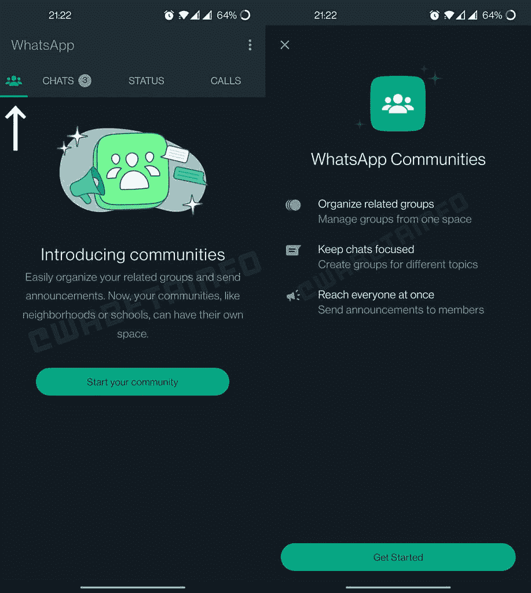

# WhatsApp 正在推出社区来选择 Android 用户

> 原文：<https://www.xda-developers.com/whatsapp-communities-select-users/>

# WhatsApp 正在推出社区来选择 Android 用户

WhatsApp 正在推出社区功能，以选择 Android 用户。它允许你把几个相关的群聊放在一个地方。

WhatsApp 在最佳即时通讯应用榜单上赢得了自己的位置。毕竟，它是世界上最常用的即时通讯服务之一。超过 10 亿人积极依赖它，Meta 一直在进一步发展这个平台，使其更加丰富。例如，该公司最近开始在主聊天列表中显示[用户的故事。更不用说隐藏自己在线状态的能力了。早在四月，](https://www.xda-developers.com/whatsapp-stories-chat-list-beta/) [WhatsApp 宣布了社区](https://www.xda-developers.com/whatsapp-making-group-chats-better/)——几个相关团体的中心。该公司终于开始在选定的 Android 用户中测试这一功能。

 <picture></picture> 

Credit: *WABetaInfo*

根据 WABetaInfo 的一份报告，WhatsApp 正在选择 Android 用户测试社区。code spelunker 提到，2.22.19.3(beta)和 2.22.19.2(stable)版本与这种服务器端部署是兼容的。收到此更新的人会发现一个新的 WhatsApp 社区标签，取代了旧的相机标签。在那里，用户可以创建一个新的社区，并向其中添加多达 10 个子组。每个分组最多可以包含 512 个成员。

当你第一次创建一个社区时，WhatsApp 会自动创建一个包含所有子组成员的公告组。这使得管理员可以很容易地一次向每个人发送相同的消息。不过，目前 WhatsApp 并没有隐藏子群体内部的电话号码。因此，其他成员将能够看到你的联系信息——直到 WhatsApp 推出隐藏电话号码的功能。

WhatsApp 社区非常适合管理学校或社区的人。这样，他们可以将所有相关的子组放在一个公共中心。如果你想得到它，你可以把你的应用程序升级到最新版本，然后等着公司给你推出。考虑到这是一个服务器端的展示，似乎没有办法强迫这个特性出现在你的界面上——不幸的是。

你发现 WhatsApp 的社区功能了吗？如果是，你打算使用它吗？请在下面的评论区告诉我们。

* * *

**来源:** [WABetaInfo](https://wabetainfo.com/whatsapp-beta-for-android-2-22-19-3-whats-new/)