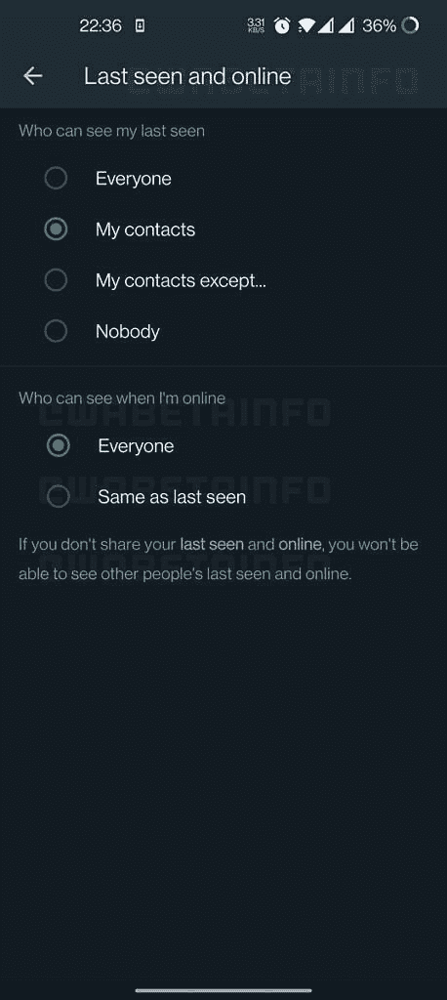

# WhatsApp 可能很快会让你隐藏自己的在线状态

> 原文：<https://www.xda-developers.com/whatsapp-hide-online-status/>

# WhatsApp 可能很快会让你隐藏自己的在线状态

WhatsApp 正在开发一项新功能，可以让你对平台上的其他用户隐藏自己的在线状态。请继续阅读，了解更多信息。

WhatsApp 在过去几周发布了几个新功能，Meta 拥有的消息应用似乎不会很快停止。继推出上次查看、个人资料照片和状态的[新可见性选项](https://www.xda-developers.com/whatsapp-new-visibility-options-last-seen-profile-photo-status/)、 [Android 到 iOS 聊天传输支持](https://www.xda-developers.com/whatsapp-data-transfer-from-android-to-ios-official/)和[对大型群聊的支持](https://www.xda-developers.com/whatsapp-512-people-limit-rolling-out/)之后，WhatsApp 现在正在准备另一项新功能。

根据最近的一份 WABetaInfo 报告，WhatsApp 正在准备一项功能，可以让你对你的联系人隐藏你的在线状态。几周前，这项功能首次出现在 iOS 版 WhatsApp 的测试版中，现在它已经进入了测试频道的 Android 应用程序。虽然在最新的 WhatsApp 测试版(v2.22.16.12)中没有直播，但 *WABetaInfo* 已经设法抓取了以下正在开发的功能的截图。

 <picture></picture> 

Credit: WABetaInfo

如截图所示，即将推出的在线状态可见性功能将出现在 WhatsApp 上次看到的隐私设置中的一个新部分。它将包括两个选项-“每个人”和“与上次看到的一样”如果您选择前者，每个人都可以看到您何时在线。但如果你选择后者，WhatsApp 会自动选择你为上次看到的功能选择的可见性选项。

根据您为上次查看功能选择的选项，您可以将您的在线状态限制为您的联系人或您的联系人，但您在上次查看功能中阻止的用户除外。您还可以通过选择标记为“没有人”的选项来阻止所有人查看您的最后显示状态和在线状态

如前所述，这项功能仍在开发中，在最新的 WhatsApp 测试版中尚不可用。我们目前没有任何关于它的推出的信息，但是一旦它开始在测试版或稳定频道推出，我们会让你知道。

* * *

**Via:** [WABetaInfo](https://wabetainfo.com/whatsapp-beta-for-android-2-22-16-12-whats-new/)