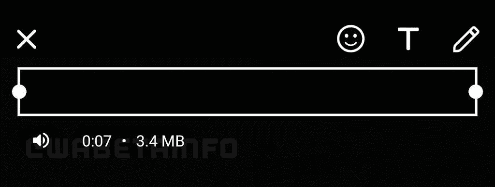

# WhatsApp 在安卓系统上增加了新的“静音视频”功能

> 原文：<https://www.xda-developers.com/whatsapp-mute-video-feature-beta/>

# WhatsApp for Android 现在可以让你在分享视频前静音

WhatsApp 正在推出一个新的静音视频功能，该功能在测试版上进行了测试，目前已在最新的稳定更新中推出。

**更新 1(****03/02/2021****@****08:57am****ET):**WhatsApp 的静音视频功能现已铺开。[点击此处了解更多信息。](#update1)文章发表于 2021 年 2 月 8 日，下面保留。

WhatsApp 正在测试一项新功能，用户可以在与联系人分享视频之前将视频静音。据说该功能已经在 WhatsApp 的最新测试版中推出，版本号为 2.21.3.13。使用最新测试版的用户应该能够在共享前编辑视频时通过点击音量开关来静音视频。

首先被 [*WaBetaInfo*](https://wabetainfo.com/whatsapp-is-rolling-out-a-mute-video-option/) 发现的是，值得注意的是，在分享前将视频静音的功能已经在 Instagram 上的直接消息下提供了一段时间。基本上相同的功能正在测试中，最终将面向所有用户。该功能在去年 11 月的前一个测试版中也被[发现，但似乎它将在最新的测试版中推出供用户尝试。](https://wabetainfo.com/whatsapp-beta-for-android-2-20-207-2-whats-new/)

 <picture></picture> 

Image: WaBetaInfo

社交消息平台的新增功能姗姗来迟。值得称赞的是，消息巨头[最近为登录 WhatsApp Web 和桌面应用的用户增加了一层额外的安全保障](https://www.xda-developers.com/whatsapp-web-desktop-require-biometric-authentication-before-device-linking/)。现在，想要在 PC 上登录 WhatsApp 的用户可以使用智能手机上的指纹或面部数据来验证登录请求。这种新的安全层取代了使用智能手机摄像头扫描二维码的旧过程，这一过程相当简单，但被认为是安全的。

WhatsApp 上个月宣布了新的隐私政策后，该公司在印度也面临艰难时期。该消息平台因没有就各种变化，尤其是与脸书共享数据的影响，对其用户进行充分的教育，而面临许多反弹。虽然许多用户被发现转向【Telegram 和 Signal 等替代应用，但印度政府要求 WhatsApp 立即撤销其新的隐私政策。在一封写给 WhatsApp 负责人 Will Cathcart 的信中，IT 部指出，当涉及到印度公民的选择和自主权时，这些变化引起了“严重关切”。政府还表示，与欧洲用户相比，印度用户受到了区别对待。

* * *

## 更新:WhatsApp 的静音视频功能正在稳定推出

WhatsApp 的静音视频功能正在 Android 用户的稳定分支(via *[FoneArena](https://www.fonearena.com/blog/334554/whatsapp-update-mute-video.html)* )中推出。在向某人发送视频之前或向其状态发布视频时，用户可以在视频编辑器中使用该功能。在裁剪工具的正下方，会有一个扬声器图标，允许用户在音频打开和静音之间切换。静音时，视频将被发送到接收器，其中没有任何音频。