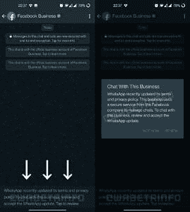

# 据报道，WhatsApp 将其有争议的隐私政策变为可选政策

> 原文：<https://www.xda-developers.com/whatsapp-optional-terms-of-service/>

# 据报道，WhatsApp 的新服务条款在未来将是可选的

新的证据表明，WhatsApp 正计划将有争议的隐私政策变成可选项。继续读下去。

今年早些时候，WhatsApp 宣布计划更新其服务条款和隐私政策，这将要求用户在向 WhatsApp 商业账户发送消息时与脸书分享他们的数据。然而，WhatsApp 未能正确传达新的变化，导致用户普遍感到困惑，迫使该公司推迟了要求所有人接受新变化的最后期限。该公司随后透露，它已将最后期限推迟到 5 月 15 日，届时不接受新政策的用户将开始看到他们的 WhatsApp 功能逐渐受到限制。然而，随着反弹的继续，WhatsApp 也被迫修改了这一变化，该公司后来证实，它已决定不删除或限制账户。现在，新的证据表明，这家脸书所有的公司可能会让新的服务条款变得可有可无。

据 [*WABetainfo*](https://wabetainfo.com/news-about-terms-of-service-they-will-be-optional/) 报道，WhatsApp 将让用户继续按原样使用服务，即使他们不接受更新后的服务条款。该公司现在计划将这一强制性变化限制在 WhatsApp 商业信息上。

简单来说，如果你使用 WhatsApp 与你的朋友和家人聊天，你可以选择忽略这些条款，继续使用该服务，而不会受到任何限制。然而，如果你想用商业账户聊天，WhatsApp 会要求你“审查并接受 WhatsApp 的更新。”

当用户尝试向商业帐户发送消息时，将显示以下消息:

 <picture></picture> 

Screenshot courtesy: *WABetainfo*

WhatsApp 一直坚称，其更新后的服务条款将只适用于向 WhatsApp 商业账户发送信息的用户。

WABetainfo 表示，WhatsApp 计划“很快”宣布服务条款的新变化，未来版本的 WhatsApp beta 将支持这一变化。WhatsApp 尚未正式确认这一新变化。