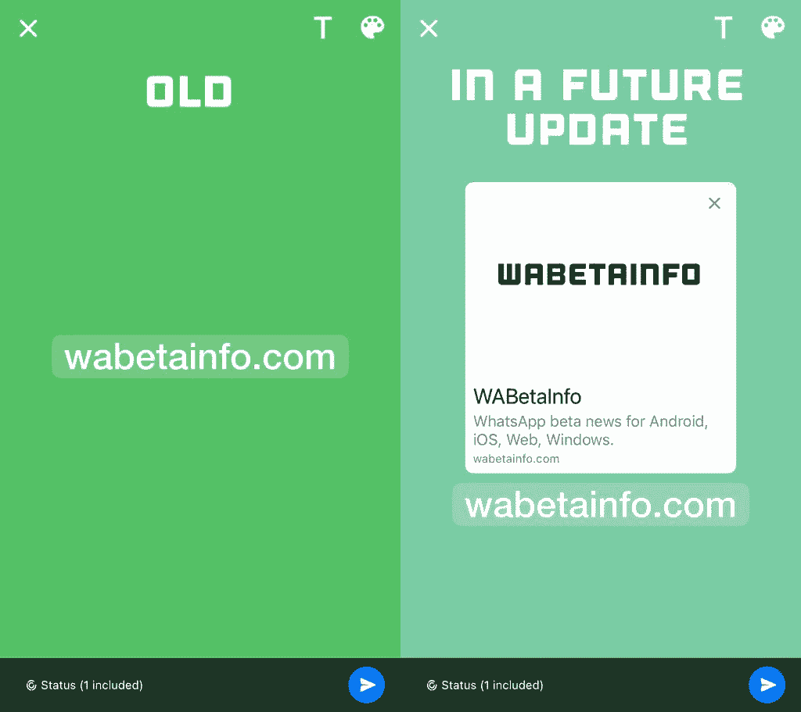

# WhatsApp 可能很快会在状态更新中显示丰富的链接预览

> 原文：<https://www.xda-developers.com/whatsapp-status-rich-link-previews/>

# WhatsApp 可能很快会在状态更新中增加对丰富链接预览的支持

据报道，WhatsApp 正在开发一项新功能，该功能将在状态更新中自动生成丰富的链接预览。请继续阅读，了解更多信息。

据报道，WhatsApp 正在开发一项新功能，可以自动将作为状态共享的 URL 转换为丰富的链接预览。WABetaInfo 在最新的 WhatsApp iOS 测试版中发现了正在开发的功能，并分享了展示即将到来的变化的截图。

目前，如果你在 WhatsApp 上分享一个 URL 作为状态更新，它不会生成链接预览。该网址显示为纯文本，但你可以点击它前往目标网站。然而，WhatsApp 的目标是通过未来的更新来改变这一点。所附的截图展示了在未来的版本中推出这一变化时，一个丰富的链接预览可能会是什么样子。预览可能包括来自目标网站的图像、标题、元描述和 URL。

 <picture></picture> 

Via: WABetaInfo

虽然在最新的 iOS 版 WhatsApp 测试版中发现了这一变化，但它尚未上线。这表明它可能处于开发的早期阶段，并可能在未来的更新中推出测试版。迄今为止，WhatsApp 尚未就此事分享任何官方信息，但我们预计这一变化将在未来几周内应用于 WhatsApp 的 Android 和桌面系统。一旦该功能开始在 beta 频道上推出，我们会尽快通知您。

在 WhatsApp [开始向所有用户推出消息反应](https://www.xda-developers.com/whatsapp-message-reactions-rolling-out/)几周后，WhatsApp 状态中支持丰富的链接预览。Meta-owned instant messenger 在过去几个月中增加了一些值得注意的功能，包括几个[群聊改进](https://www.xda-developers.com/whatsapp-making-group-chats-better/)，帮助用户[快速开始与未保存的联系人聊天的新功能](https://www.xda-developers.com/whatsapp-beta-chat-unsaved-contacts/)，以及支持[共享最大 2GB 的文件](https://www.xda-developers.com/whatsapp-file-limit-increase-2gb/)。

*您认为 WhatsApp 最近新增的哪些功能有用？请在下面的评论区告诉我们。*

* * *

**来源:** [WABetaInfo](https://wabetainfo.com/whatsapp-is-working-on-rich-link-previews-for-text-status-updates/)