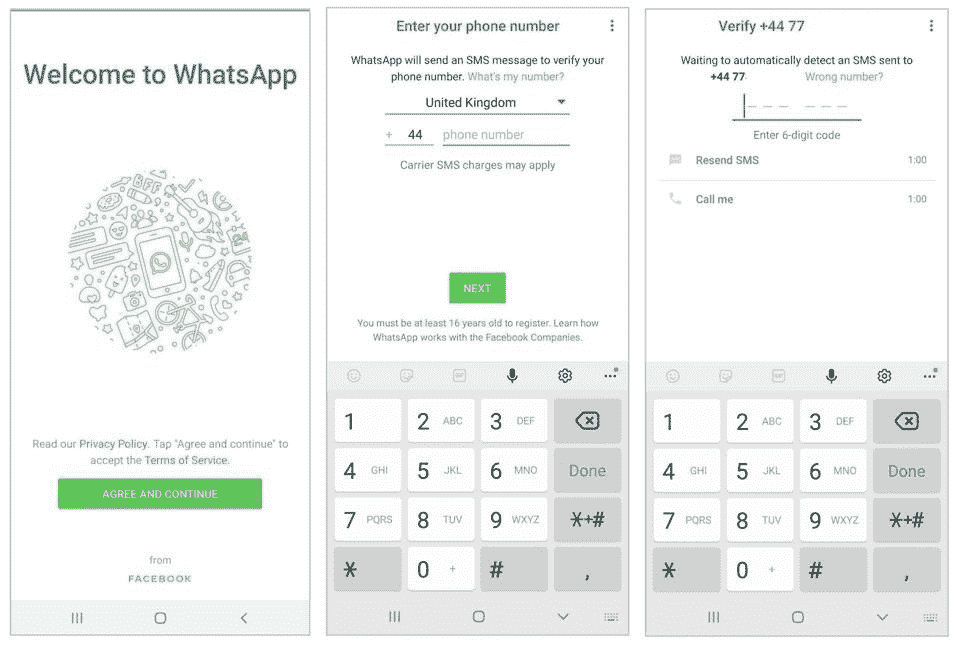
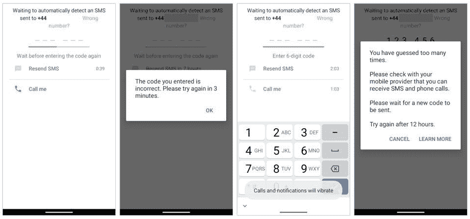
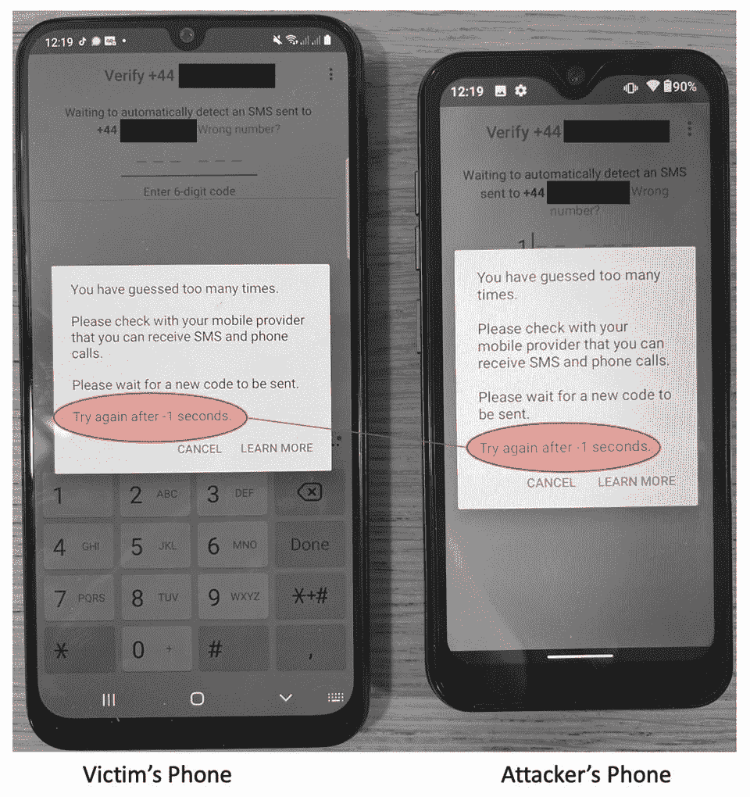
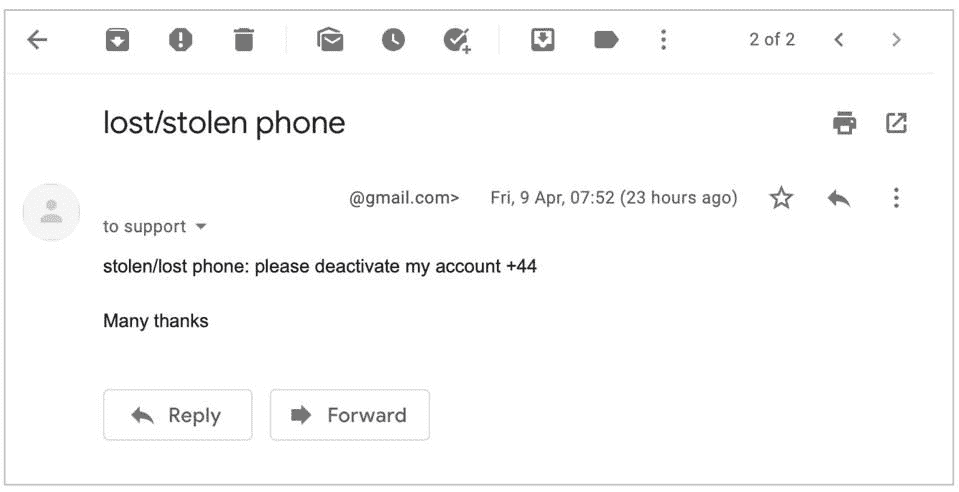
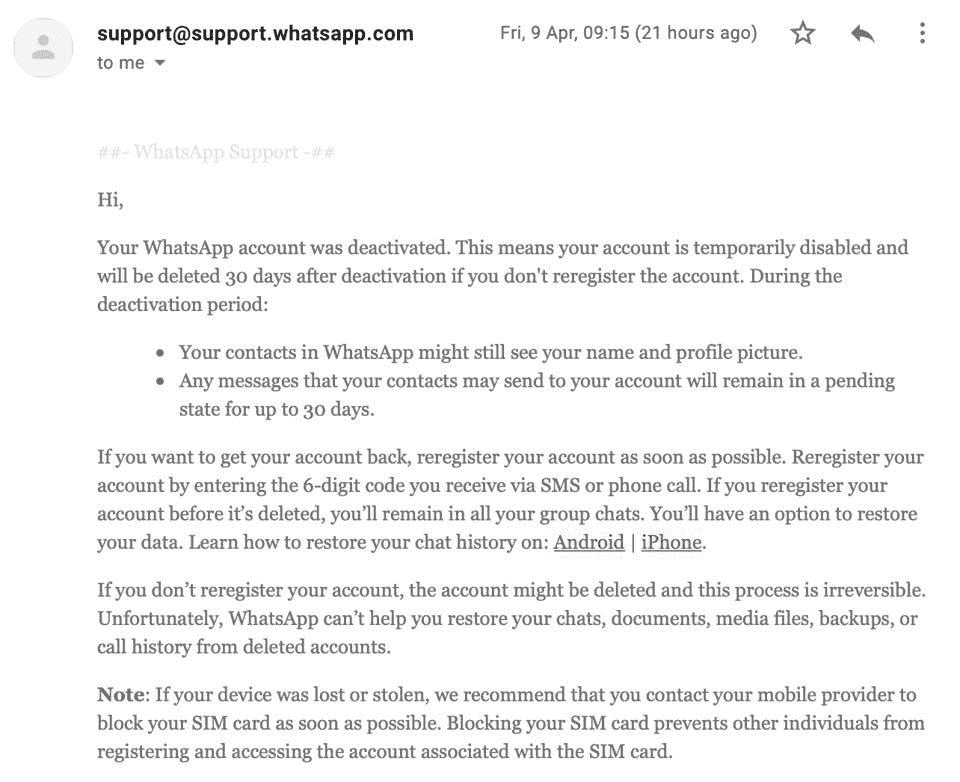

# 这个 WhatsApp 漏洞非常愚蠢，但它可以无限期地锁定你的帐户

> 原文：<https://www.xda-developers.com/whatsapp-vulnerability-lock-out-account/>

安全研究人员在 WhatsApp 中发现了一个新的漏洞，该漏洞可能会促使更多用户[退出脸书旗下的消息服务](https://www.xda-developers.com/best-whatsapp-alternatives/)。恶意行为者可以很容易地利用这个漏洞无限期地将你锁定在 WhatsApp 帐户之外，这对于 messenger 的 20 多亿用户来说不仅仅是一个小小的不便。但这还不是最糟糕的。

据研究人员路易斯·马奎兹·卡平德罗(Luis Márquez Carpintero)和埃内斯托·卡纳莱斯·佩雷拉(Ernesto Canales perea)([via*福布斯*](https://www.forbes.com/sites/zakdoffman/2021/04/10/shock-new-warning-for-millions-of-whatsapp-users-on-apple-iphone-and-google-android-phones/?sh=1624fafa7585) )称，攻击者不需要任何特殊的软件或培训就可以利用这一漏洞。他们只需要知道你的电话号码。一旦他们有了这一点，他们可以毫不费力地将你锁定在 WhatsApp 账户之外。它是这样工作的。

每当你在新设备上登录时，WhatsApp 都要求双重认证。为此，该服务会向您的电话号码发送一个六位数的代码进行验证。如果你多次输入错误代码，WhatsApp 会自动暂停你的账户 12 小时。

 <picture></picture> 

Phone number verification process (Image: Forbes)

攻击者可以通过在新设备上安装 WhatsApp，输入你的电话号码，并重复输入错误的代码来利用这种双因素认证系统。虽然这将阻止你在接下来的 12 个小时内登录新设备，但不会影响你当前的 WhatsApp 安装。它会像预期的那样继续工作。

 <picture></picture> 

Entering wrong code leads to 12-hour suspension (Image: Forbes)

为了防止您无限期地登录新设备，攻击者只需重复上述步骤三次。在第三个 12 小时周期，应用程序的暂停计时器将中断，并开始显示“-1 秒”计时器。一旦这个错误出现，WhatsApp 根本不会让你在新设备上登录。但是，您当前的安装将继续工作。但是，漏洞利用并没有就此结束，因为它可以被向前链接，以大幅增加其影响。

 <picture></picture> 

Phone number verification countdown bug showing -1 seconds (Image: Forbes)

攻击者的最后一步也将破坏你当前的安装，你将被永久锁定帐户。为此，攻击者需要做的只是向 WhatsApp 发送一封电子邮件，要求该服务停用你的电话号码。WhatsApp 可能会发送自动回复，要求攻击者确认该号码，一旦他们确认，WhatsApp 会在你不知情的情况下自动停用你的账户。

 <picture></picture> 

Email to WhatsApp Support to deactivate account (Image: Forbes)

然后，您当前的 WhatsApp 安装将突然停止工作，您将看到以下通知:*“您的电话号码不再在此手机上的 WhatsApp 中注册。这可能是因为您在另一部手机上注册了它。如果您没有这样做，请验证您的电话号码以重新登录您的帐户。”*现在，当你尝试验证你的电话号码时，你会看到“-1 秒”暂停计时器，你将根本无法登录。

 <picture></picture> 

WhatsApp's automated response to deactivation email (Image: Forbes)

由于这种攻击并不复杂，任何人只要能接触到你的电话号码，就能在几天内轻易地将你的 WhatsApp 账户锁定。因此，WhatsApp 需要立即解决这个突出的问题。

* * *

信使已经被警告了这个问题。作为对这一披露的回应，WhatsApp 的一位发言人告诉《福布斯》杂志(Forbes)的记者(T1)，*“提供一个包含两步验证的电子邮件地址，有助于我们的客户服务团队在人们遇到这种不太可能的问题时提供帮助。”【WhatsApp 认为这是一个“不太可能”的问题，这一事实足以让许多用户放弃这项服务。最重要的是，这位发言人补充说，那些试图利用漏洞的人将违反 WhatsApp 的服务条款。好像这样就能吓跑所有的黑客，防止恶作剧者试图利用一个不知情的用户。*

我们敦促我们的读者不要利用这个漏洞，不是因为违反 WhatsApp 的服务条款会让你坐牢，而是因为这是一件相当糟糕的事情。此外，如果你最终准备好切换到不同的服务，请查看我们关于 WhatsApp 替代品的[深度指南](https://www.xda-developers.com/best-whatsapp-alternatives/)，它强调了切换到另一个平台的所有利弊。