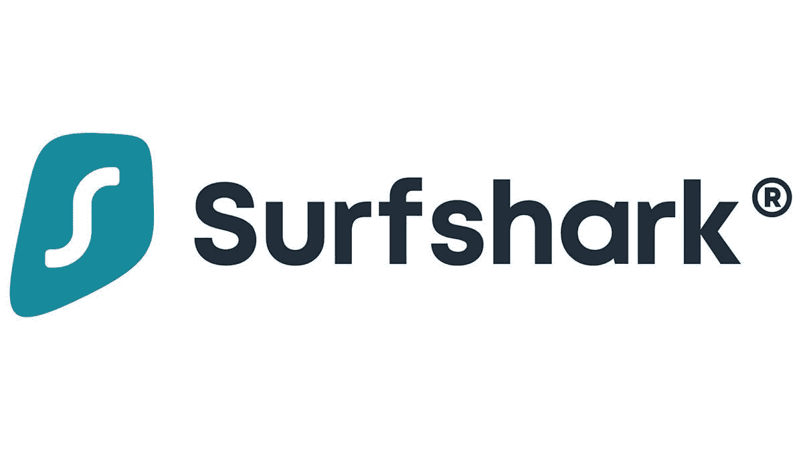
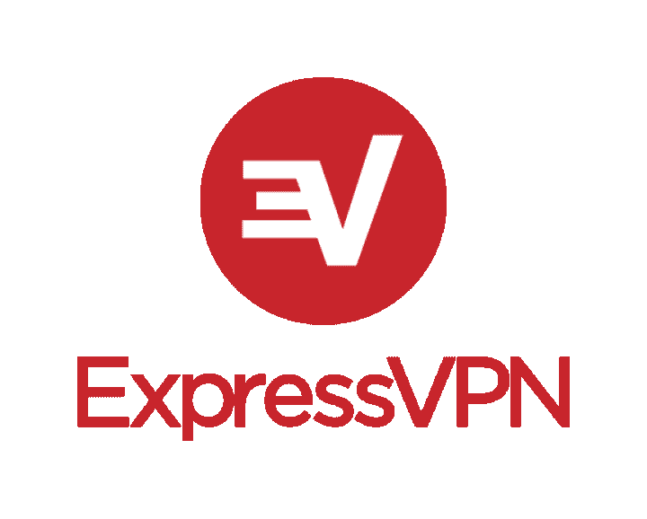
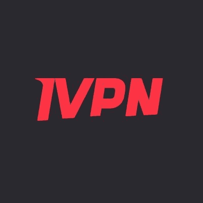
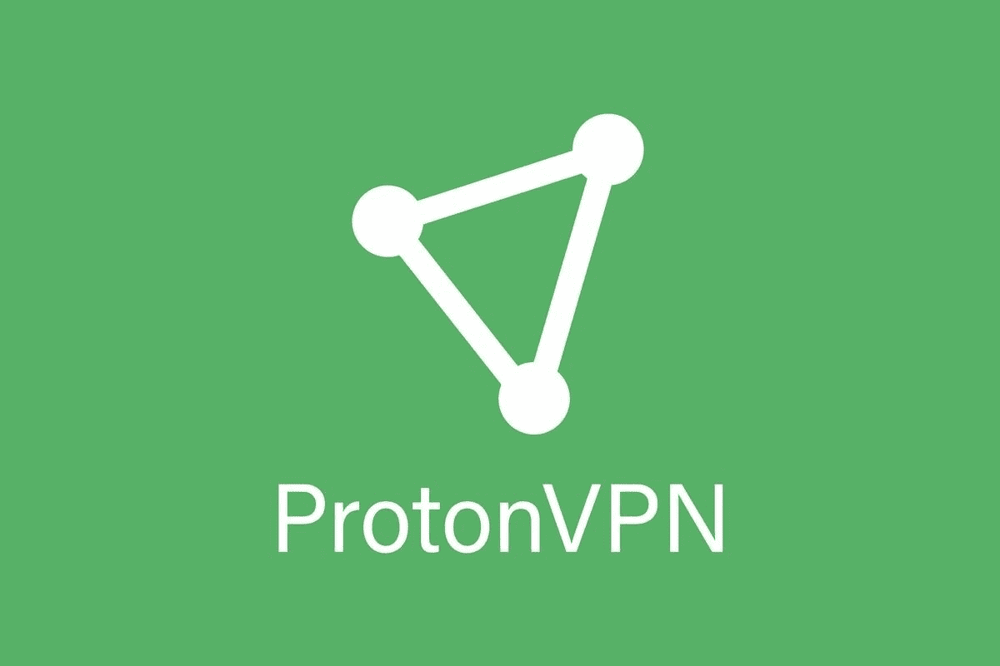

# 2023 年最佳 VPN 提供商

> 原文：<https://www.xda-developers.com/why-many-people-use-virtual-private-networks-in-australia/>

我们在网上花了很多时间，但在这个日益数字化的世界里，网络威胁或网络罪犯想要获取您的信息的风险增加了。幸运的是，有一种简单的方法可以在数据通过互联网传输时锁定数据。有了 VPN(虚拟专用网)，你可以通过伪装你的 IP(互联网协议)地址和加密你在网络上共享的所有数据来隐藏你的位置。这样，你在网上将完全匿名，黑客几乎不可能进入你的网络窃取你的信息。当然，虚拟专用网不会让你免于每一次网络攻击(更多信息，请查看我们关于 T2 常见虚拟专用网误解的文章)，但是一些安全总比没有安全好。虚拟专用网也非常适合绕过某些网站的地理限制，例如，你可以观看仅在另一个国家的流媒体服务上提供的节目。您还可以根据您的位置绕过数据节流、性能限制、审查等。

当然，决定使用哪种 VPN 可能会很棘手，因为市场上有太多的 VPN。下面，我们列出了 2023 年您可以使用的最佳 VPN 服务，无论您使用的是智能手机、平板电脑、笔记本电脑、PC、游戏机还是其他连接设备。

## 最佳 VPN: Mullvad

自 2021 年 6 月以来，Mullvad 凭借其安全实践、透明度和广泛的服务器，在我们的最佳 VPN 列表中名列榜首。你可以访问 37 个国家的 771 台服务器。该服务还声称不保留任何用户活动日志，甚至接受现金支付服务费用，所以如果你愿意，你可以保持匿名。比特币、比特币现金、电汇、贝宝和其他支付模式也可用。

它还支持 WireGuard 协议。在应用方面，Mullvad 提供了 Windows、macOS、Linux、iOS 和 Android 的官方应用。如果 Mullvad 应用程序不适用于您的平台，或者您不想使用它，您可以使用兼容的 OpenVPN 或 WireGuard 客户端以及下载的配置文件。

Mullvad 在定价方面也非常直截了当——每月 5 欧元(6 美元)的固定费率。然而，你可以通过从支持的经销商那里购买或者使用 Mozilla VPN 或 MalwareBytes Privacy 来达成交易，这两者都使用 Mullvad 的网络。

 <picture></picture> 

Mullvad

##### 什么事

Mullvad 是一个值得信赖的，快速的，易于使用的 VPN，使制定计划变得容易。它还带有许多服务器位置。

## 最实惠的 VPN: Surfshark

VPN 可以做很多事情，所以你可能会认为这些工具会很贵。但是 Surfshark 是 VPN 服务的一个很好的例子，它可以以低廉的价格做所有这些伟大的事情。

每月花费不到 3 美元，Surfshark 就能让你访问遍布 65 个国家的 3200 多台服务器的网络。这些服务器中的每一个不仅速度快，而且受到专用 DNS 和严格的无日志策略的保护。Surfshark 声称其服务器也是“P2P 友好的”，如果你打算使用你的 VPN 进行 torrenting 或类似的活动，这是必不可少的。

当连接到 Surfshark 的一个快速服务器时，您可以访问流媒体平台，如网飞、迪士尼 Plus、亚马逊 Prime Video、BBC iPlayer、Hulu 等，即使它们在您的国家/地区没有正式提供。Surfshark 的独特之处还在于，它可以让你从一个帐户连接任意多的设备。如果你想在各种设备上播放内容，这非常有用。

但是 Surfshark 不仅仅是一个伟大的流媒体 VPN 它也非常适合您所有的安全和隐私需求。它保护您免受恶意软件、网络钓鱼、网络跟踪器和垃圾广告的侵害。此外，还有强大的 256 位加密、kill switch、无边界模式、无日志记录策略、私有 DNS 和泄漏保护、伪装模式和安全协议。

 <picture></picture> 

Surfshark

##### 冲浪者

对于任何想要一个便宜但有效的 VPN 的人来说，你最好的选择是 Surfshark。每月花费不到 3 美元，它提供了一系列出色的功能，易于使用的应用程序和令人印象深刻的性能。

## 初学者的最佳 VPN:express VPN

ExpressVPN 是一种很好的 VPN 服务，因为它易于使用，性能卓越，服务器网络广泛。简而言之，这家总部位于英属维尔京群岛的公司拥有顶级 VPN 服务的所有功能，而没有太多复杂性。

有了 ExpressVPN，您就可以在全球 160 个地点拥有 3，000 多台服务器。使用 ExpressVPN 的快速服务器，您可以从世界任何地方访问几乎任何流媒体服务。它也适用于所有平台，如 Android、iOS、Windows、Mac 和 Linux。它的用户界面超级容易导航，让您连接到最佳可用的 VPN 服务器或从全球 VPN 服务器列表中选择。只需加载软件，选择您想要连接的位置，然后单击按钮。它还使订阅变得简单，只有三个选项。您可以在 12 个月内每月支付 8.32 美元，6 个月内每月支付 9.99 美元，或者一个月计划每月支付 12.95 美元。

ExpressVPN 还提供了许多其他出色的功能，包括内置的 kill switch、TrustedServer 技术、专用 DNS、VPN 分割隧道、无日志记录策略、256 位加密、速度测试等等。但是要记住的是，ExpressVPN 有一个有点严格的五台设备限制。

 <picture></picture> 

ExpressVPN

##### ExpressVPN

如果你正在寻找一个易于使用的 VPN，没有比 Express 更远的了。它提供了强大的功能、卓越的性能、庞大的全球服务器网络、顶级流媒体网站的访问权限等等。

## 最佳透明度:IVPN

IVPN 是另一个伟大的 VPN 提供商，因为它的安全实践和透明度。该服务声称不会保留任何用户活动日志，你不需要电子邮件来注册。然而，它在服务器的数量上落后了—仅在 30 多个国家提供大约 75 台服务器。IVPN 提供了 WireGuard、OpenVPN 或 IPSec 协议的选择，它可以与自己的应用程序或任何兼容的客户端一起使用。

IVPN 提供两种计划:标准和专业。虽然标准计划(每周 2 美元或三年 140 美元)仅限于两台设备，但专业计划(每周 4 美元或三年 220 美元)包括对多达七台设备的支持，并获得了端口转发、多跳和反跟踪器支持等额外功能。对于支付，您可以使用现金、Monero 或比特币进行匿名支付。也支持信用卡和 PayPal。该服务为 Windows、macOS、Linux、iOS 和 Android 提供官方应用。

 <picture></picture> 

IVPN

##### IVPN

IVPN 是一个伟大的 VPN 服务，具有透明的政策，没有用户活动日志。你不需要电子邮件来注册，你可以使用各种支付方式来购买灵活的计划。

## 最佳免费 VPN: Windscribe 免费

WindScribe 是一个流行的 VPN 服务，提供了一个相当不错的免费选项。与大多数免费的 VPN 不同，它提供每月 10GB 的带宽，可以访问 10 个国家的服务器，并且无限制连接。WindScribe 还声称，它不会保留任何可以用来识别你的日志，这意味着它只会记录你上次使用他们的服务的时间以及过去 30 天内使用的带宽总量。

WindScribe 易于使用，并提供体面的速度。它也有几乎所有主要平台的应用程序和浏览器扩展。此外，它与网飞和其他流媒体服务配合得很好，可以绕过地理限制。Windscribe 的付费服务也很棒，价格实惠，支付计划灵活。如果你不关心它在一个五眼国家的存在和他们保留的最小日志，它值得考虑。

 <picture></picture> 

Windscribe

##### Windscribe

Windscribe 提供了一个很棒的免费 VPN 选项，拥有相当数量的服务器和良好的月带宽。

## 带宽最高的最佳免费 VPN:proton VPN

如果你不喜欢每月带宽的限制，并愿意牺牲速度来摆脱它们，ProtonVPN 的免费计划是一个极好的选择。你可以获得无限的月带宽，但付费会员的连接将优先于你的连接，所以你可以期待看到速度下降。此外，ProtonVPN 的免费计划仅适用于三个 VPN 位置——美国、日本和荷兰。如果隐私是你使用 VPN 的主要原因，那么有限的位置对你来说不是问题。但如果你想访问只在特定国家可用的内容，你最好使用付费 VPN。

我们也喜欢它的应用程序是开源的，并且 Mozilla 已经审核了它们。此外，所有关键的 VPN 功能，如分割隧道(仅在 Windows 和 Android 上)、无日志记录和终止开关，都可以在 ProtonVPN 上使用。这项服务也不会在免费计划中用广告轰炸你。但是，您将仅限于一个连接。为了获得更多的几乎任何东西——国家、服务器、速度、连接——你可以在两年内每月支付 4.99 美元。

 <picture></picture> 

ProtonVPN

##### 质子 VPN

ProtonVPN 的免费计划带有无限带宽，但它只能让你访问三个 VPN 位置。如果您想从服务中获得更多，还有其他付费计划。

## 最佳服务器负载 VPN:私人互联网接入

当选择 VPN 服务时，要考虑的一个重要因素是它提供的服务器数量。通常，最好的 VPN 服务提供大型服务器网络，私人互联网接入在 77 个国家拥有令人瞠目结舌的 24，364 台服务器。由于有如此多的全球服务器可供选择，你应该会发现绕过受限网站并取消阻止网飞、YouTube、Hulu、亚马逊 Prime Video 和许多其他流媒体平台等服务非常容易。

通过在您的设备上安装私人互联网接入，您还可以保护自己免受恶意软件、网络追踪器和不想要的广告的侵害。您还可以获得各种各样的 VPN 协议，包括 WireGuard、OpenVPN、PPTP 和 L2TP/IPSec。

私有互联网接入提供的其他强大功能包括 P2P 支持、在一个订阅下使用多达 10 个设备的能力、无限带宽、无流量日志记录策略、SOCKS5 代理以及适用于每个主要操作系统的原生应用。高级订阅价格合理，两年计划每月仅花费 2.69 美元。

 <picture></picture> 

Private Internet Access

##### 私人互联网接入

有了大型 VPN 服务器网络，您可以做很多事情，而专用互联网接入在世界各地提供了超过 24，000 台服务器。它还具有其他强大的功能，包括专家支持、10 台设备限制等等。

* * *

当选择你每天都要使用的 VPN 时，重要的是要注意它支持哪些设备，速度有多快，给你多少数据，以及它是否符合你的预算。不管怎样，无论你和谁一起去，你都会得到额外的安全保障，这在这个数字时代非常重要。我们向大多数人推荐 Mullvad，因为它以合理的价格提供您需要的一切。然而，根据您的需求，有免费的 VPN 和更复杂的选项。