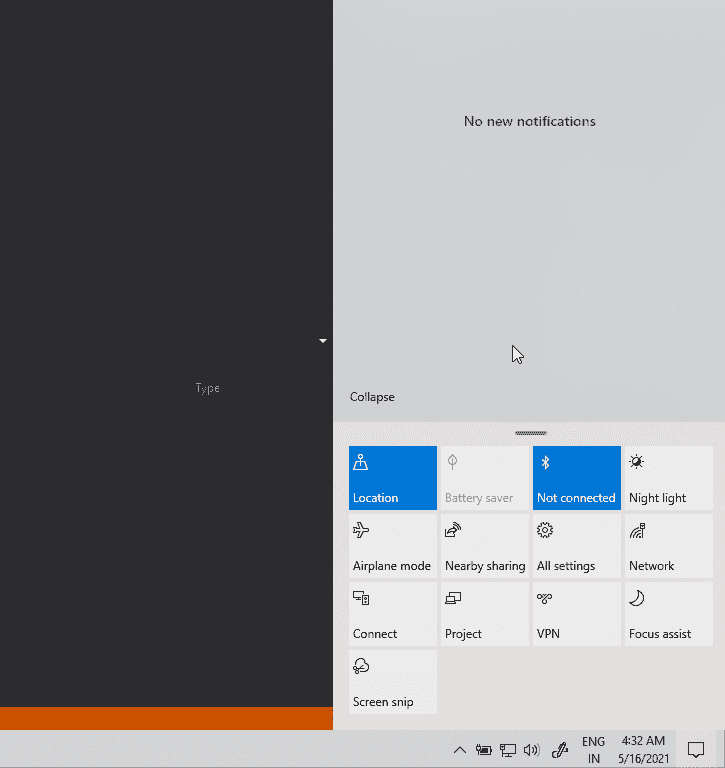

# Windows 10 泄露了借鉴 Windows 10X 的设计变更

> 原文：<https://www.xda-developers.com/windows-10-leak-design-changes-windows-10x/>

# Windows 10 泄露暗示借鉴了微软已取消的 Windows 10X 的设计变更

根据一个新的泄露，受微软取消的 Windows 10X 启发的 UI 变化可能会在年底前出现在 Windows 10 中。

以防你错过新闻，Windows 10X [被取消](https://www.xda-developers.com/microsoft-windows-10x-back-burner/)。Windows 10X 应该是微软的一个新的“轻型”操作系统，它不是基于他们现有的 Windows 10 代码，而是从头开始构建的。它最初是为双屏设备设计的(当时没有，现在也没有)，但后来这个限制被取消了，它更多地被定位为廉价电脑 Chrome OS 等轻量级操作系统的竞争对手。它还提供了一些与普通 Windows 10 明显不同的设计选择。虽然 Windows 10X 火车可能永远不会离开车站，但喜欢这些 UI 变化的用户可能会很高兴知道其中一些可能会转向 Windows 10。

*Windows 最新*，一个专注于 Windows 的网站，[已经得到了](https://www.windowslatest.com/2021/05/17/windows-10-leak-hints-at-action-center-ui-tweaks-and-more-rounded-corners/)似乎是 Windows 10 即将到来的太阳谷更新的截图和 gif，它显示了 Windows UI 几个部分的几个关键 UI 变化。其中之一是 Windows 10 操作中心的变化，包括上下滑动底部快速设置切换以显示或隐藏它们的能力。到目前为止，它看起来和现有的动作中心没有太大的不同，尽管我们还得看看在以后的版本中是否会有进一步的改进。

 <picture></picture> 

The revamped Action Center in action. Image credits: *Windows Latest*

之前泄露的其他设计元素包括圆角浮动菜单，适用于跳转列表，但这不是我们唯一能看到它们的地方。根据同样的 *Windows 最新*独家报道，微软无意中分享了一个即将为开发者提供的功能的截图，其中包括一个带有圆角的 Windows 应用程序对话框。这种新设计可能适用于确认对话框、警告和警报对话框以及 Windows 中的其他对话框。

预计太阳谷将于今年年底推出更新 21H2，这将是自首次发布以来 Windows 10 最大的更新之一。