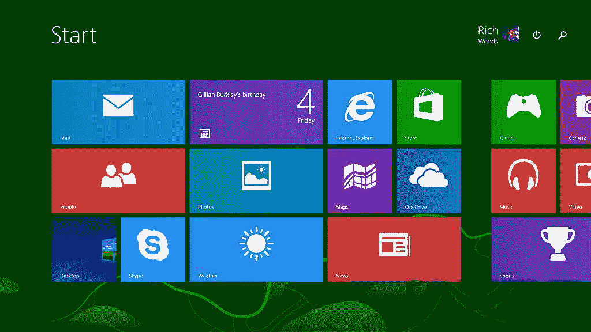
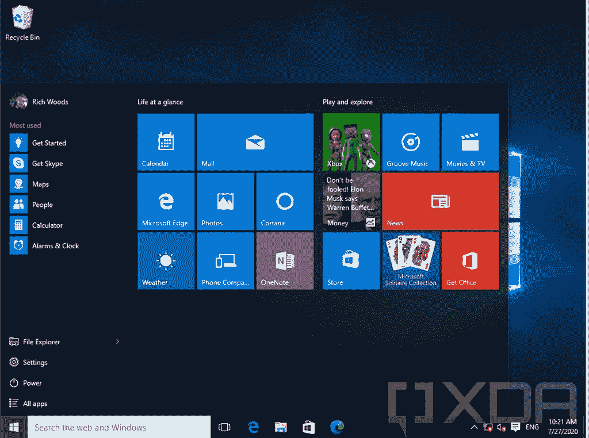
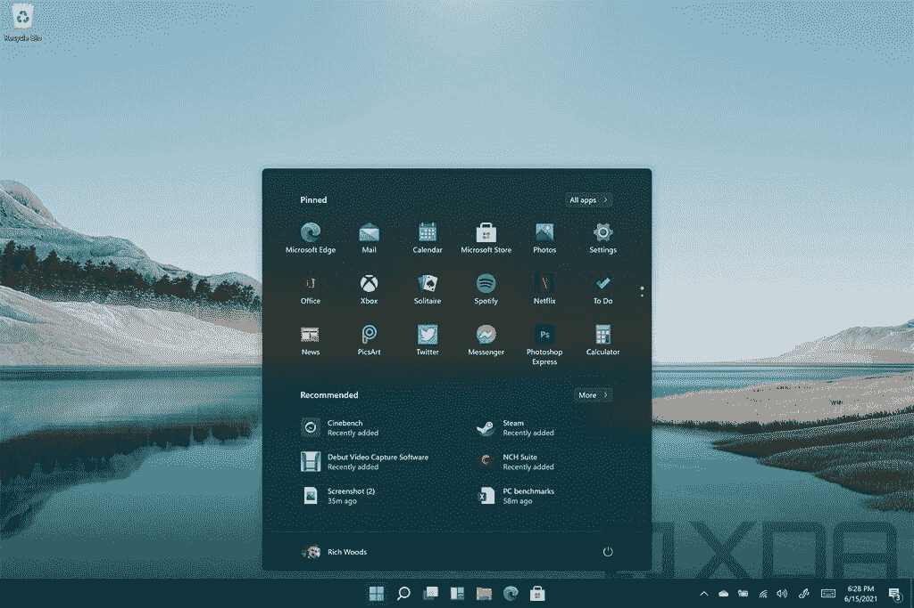
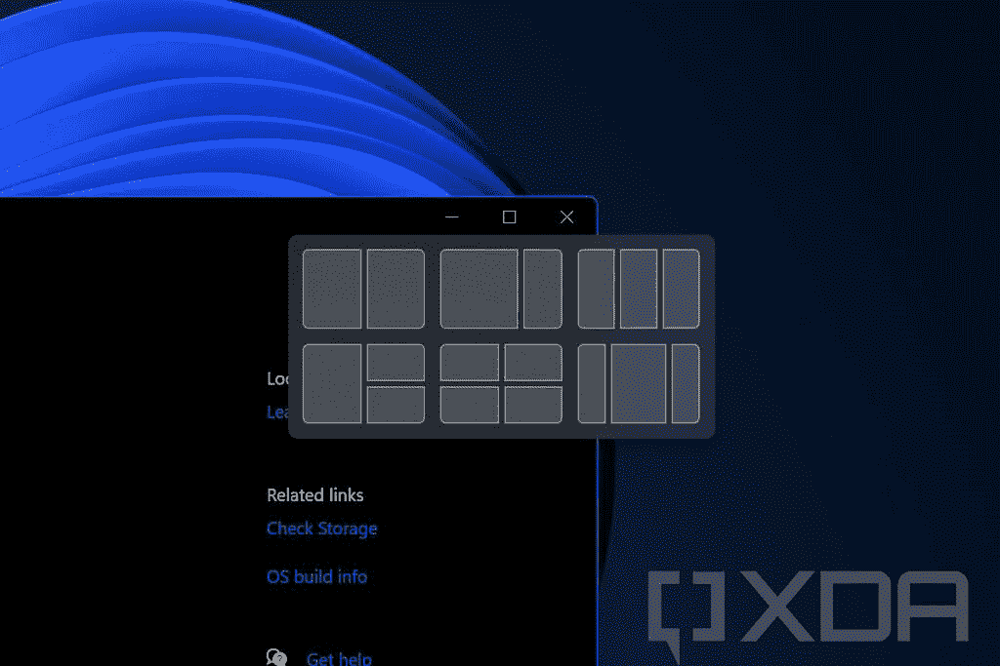
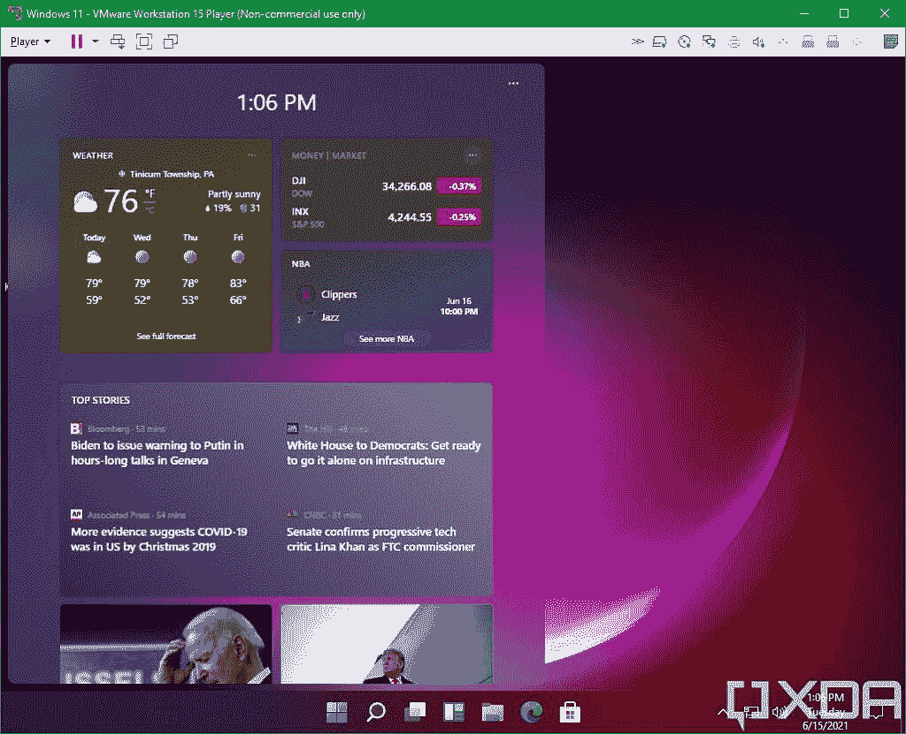
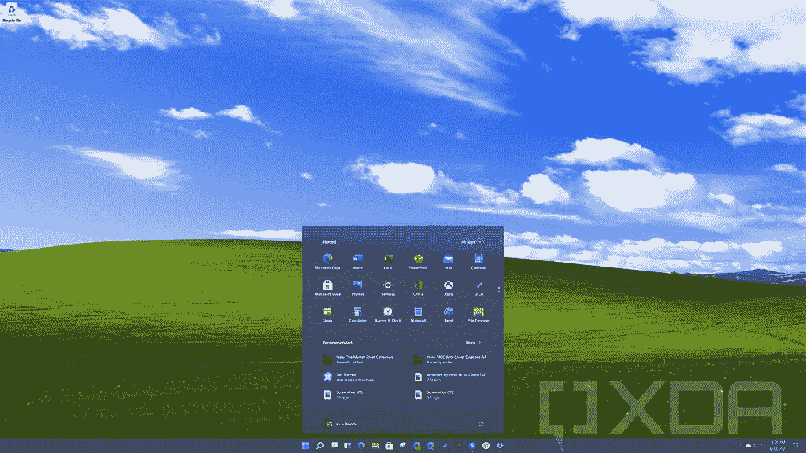

# 如果只有新的 Windows 11 设计，我会很满意

> 原文：<https://www.xda-developers.com/windows-11-design-fine-with-that/>

我们现在离发布 [Windows 11](https://www.xda-developers.com/windows-11/) 和[只有几天了，由于一个泄露](https://www.xda-developers.com/hands-on-windows-11/)，我们已经看到了大部分的设计。如果你继续安装 Windows 11 build 21996.1，你可能会和其他人一样得出相同的结论——这只是采用新设计的 Windows 10。

我是 Windows 用户，这意味着我更喜欢它而不是台式机。我家的第一台电脑是在我四岁的时候出现的；它有一个英特尔 8088 处理器，运行 MS-DOS。我们的第二台电脑运行 Windows 3.1，第三台运行 Windows 98，第四台运行 Windows XP。后来我搬出去了，用了此后的每一个版本的 Windows。我零售买了 Windows Vista 和 Windows 8，Windows 7 是新 PC 自带的，Windows 10 是免费升级的。

我在这里要说的是，如果 Windows 11 中所有的新东西都是设计上的改变，我完全可以接受。

## 争议观点:Windows 10 的设计很糟糕

我不会说这么多，但尽管我是一个 Windows 的忠实拥护者，我实际上从 Windows 7 开始就没有喜欢过 Windows 的设计。我喜欢微软在 Windows 8 上尝试新事物，并认为如果公司没有走那么多弯路，UX 是有潜力的，但我从不喜欢实际的设计。

### 每个人都知道 Windows 8 不好

我从未将 Windows 8 或 Windows 10 的设计视为经典之作。我会称之为时尚。如果你当时看的是 Windows 8，甚至是 Windows Phone，你可能会说它好看。然而，这是那种你在十年或二十年后回顾时会问的事情，“我们都在想什么？”

 <picture></picture> 

Windows 8

另一方面，看看苹果的 iOS 5，或者坦率地说，那个时代的任何版本的 iOS。它看起来肯定过时了，但看起来仍然很漂亮。这是一个经得起时间考验的设计。没有人会回过头来问我们怎么会觉得它好看。

Windows 8 充满了过于明亮的颜色、尖锐的边角和应用环境中不和谐的变化。但我们不要在 Windows 8 上花太多时间，因为每个人都知道它很糟糕。Windows 10 本应解决所有这些问题。

### Windows 10 本应修复一切

当 Windows 10 发布时，它应该吸取 Windows 7 和 Windows 8 的精华，并将其全部放入一个 OS 中。它确实做到了。开始菜单做出了回归，桌面应用环境现在是唯一的，最终让用户把商店应用放在 windows 中。当这种情况发生时，人们称赞 Windows 10 是修复一切的东西。

 <picture></picture> 

Windows 10 version 1507

我们都听说过其他版本的 Windows 都不错吧？Windows 8 很差，Windows 7 很好，Windows Vista 很差，Windows XP 很好，Windows ME 很差，Windows 98 很好，等等。按照这种逻辑，Windows 10 是好的，它也因此受到欢迎。微软习惯以自己的方式做事，让每个人都抓狂，然后接受反馈并修复它，但仍然没有为下一个产品吸取任何教训。

当然 UX 修好了，但是 Windows 10 还是不好看。用起来还是感觉不太好。与更微妙的圆角相比，尖角本身看起来很不协调。那些明亮的磁贴仍然包含在开始菜单中，直到去年微软才最终开始修复这个问题。

我更喜欢 Windows 有很多原因，但设计已经很久没有成为其中之一了。

### Windows 10 对于平板电脑来说也很可怕

Windows 10 的一大目标是减少 Windows 8 的错误。在某些领域，微软缩减了太多。它从一个主要为[平板电脑](https://www.xda-developers.com/best-windows-tablets)和触摸屏构建的操作系统，变成了一个根本没有为平板电脑优化的操作系统。

正如我提到的，Windows 8 在应用环境上有一个不和谐的转变。如果你打开一个商店应用程序——叫做 Metro 应用程序——你必须从屏幕顶部向下滑动才能关闭它，如果它是打开的，它只能是全屏的。你可以从左边滑入切换到不同的应用程序，从右边滑入访问各种设置的魅力。平板电脑上会有一个 Windows 徽标，你可以点击它来启动开始屏幕。

这是一个巨大的失误。作为对 iPad 的回应，微软突然决定所有东西都要有触摸屏，并且必须为它设计 Windows。不要介意这个已经被安装在很多传统设备上的事实。

 <picture></picture> 

Windows 10 version 21H1 tablet mode

当 Windows 10 发布时，这些滑动手势在很大程度上已经消失了。毕竟，尽管触摸屏很受重视，但事实证明绝大多数设备要么是传统的[笔记本电脑](https://www.xda-developers.com/best-laptops/)，要么是被用作传统笔记本电脑的触摸屏设备。Windows 10 有一个平板模式，你必须手动打开，它可以全屏显示应用程序，并进行一些其他调整，但仍然不是很好。

Windows 10 并不是一个触摸优化的操作系统。这就是为什么一直有这么大的焦点放在笔和 Windows 上，因为用手指使用它不是一个好的体验。

## Windows 11 设计修复了一些东西

自从 build 21996.1 泄露后，我不仅一直在用，还一直在我的主桌面上用。公平地说，我已经在 Windows 11 上生活了很长时间。如果是这样，我很满意。

### 外观和感觉都变了

Windows 11 修复了过去十年我对 Windows 最大的一些抱怨，那就是设计。变化有的小，有的大。这里有一个小的:任务栏终于居中了。多年来，我一直使用 TaskbarX 来做这件事，并想知道为什么微软没有让我们通过设置将任务栏居中。

 <picture></picture> 

Windows 11 build 21996.1

开始菜单是最大的变化。它也是居中的，并且是浮动的。虽然微软花了数年时间将 Live Tiles 越来越多地推到后台，但在 Windows 11 中，它们的所有痕迹最终都消失了。有固定的图标，而不是固定的磁贴，这些图标是透明的。下面是推荐的快捷方式、文档等。

这几乎是一个笑话，在这一点上，新的“太阳谷”设计大修是集中在圆角。当然不是；其实圆角大概是最小的变化之一。感觉很大，因为尖角看起来不舒服，这就是我们自 2012 年以来一直关注的问题。

我们也有新的系统声音。就像新 UX 更悦目，声音更悦耳一样。当你改变音量时，Windows 11 仍然会发出钟声，但这实际上是我不介意听到的东西。

 <picture></picture> 

Windows 11 build 21996.1

动画感觉也更愉快。不仅仅是立即启动或关闭应用程序，还有更多过渡动画。当你抓取应用程序时也是如此。此外，如果你悬停在最大化按钮上，会有更多的应用程序捕捉选项，这总是受欢迎的。

### Windows 11 的设计也更适合触控

需要澄清的是，根据泄露的 Windows 11 版本，Windows 并不是一个好的平板电脑操作系统。只不过比 Windows 10 好一点，这是一个很低的杠杠。

平板模式已经一去不复返了，微软正在努力做它一直以来都应该做的事情。它试图让你的电脑无论是作为平板电脑还是笔记本电脑都能正常工作。老实说，新的开始菜单是...好吧，这是个开始。

 <picture></picture> 

Windows 11 build 21996.1

Windows 11 还支持手势，这类似于你可以在精密触摸板上做的事情，只是在屏幕上。你可以用三个手指向下滑动并最小化应用程序，或者用三个手指向上滑动以进入任务视图。你也可以用四个手指按住屏幕在虚拟桌面之间切换。

按照动画的思路，用触摸操作应用应该更容易。如果你抓住一个应用程序拖动它，它会随着模糊的边界收缩，这样你就可以看到你已经抓住了它。

## 这个设计不适合 Windows 11

在看到泄露的构建时，很容易相信这就是它的全部。毕竟，这将是对 Windows 10 的太阳谷更新，所以看起来微软只是简单地进行了 Windows 10 的功能更新，并将其命名为 Windows 11，以围绕它进行宣传。

这仍然不是完全错误的，但这个故事比我们看到的要多得多。明确一点，Windows 11 build 21996.1 不是早期版本。这是一个接近最终版本的版本，版本 22000 是应该发布的版本。除了一些修正，这些部分不会改变。

 <picture></picture> 

Windows 11 build 21996.1

相反，我们将看到 Windows 功能体验包，这是微软在 Windows Insider 计划中一直在折腾的东西，但没有说太多它们的用途。现在，OEM 厂商可以获得 Windows 11 build 22000，而 OS 要到稍后才能完成。

我认为，当微软正式推出 Windows 11 时，你会看到它不仅仅是一个新的设计，它被称为 Windows 的新版本是合适的。然而，这并不是本文的主题。

我在这里要说的是，如果这个泄露的 Windows 11 版本只是以新的外观发布，我会在这里支持它。用 Windows 11 就是感觉比用 Windows 10 好那么多，再也不想用别的了。这让我对微软可能会做的任何事情更加兴奋。