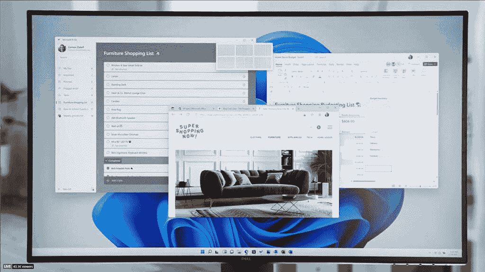
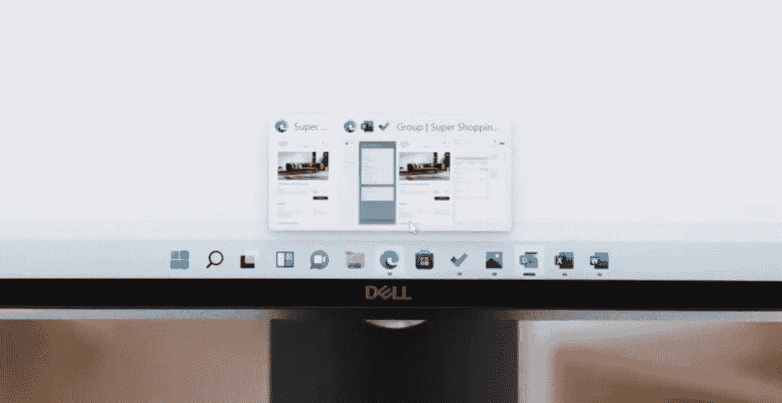

# Windows 11 的快照布局和快照组使多任务处理更加简单

> 原文：<https://www.xda-developers.com/windows-11-snap-groups-snap-layouts/>

# Windows 11 的快照布局和快照组使多任务处理更加简单

Windows 11 为那些经常进行多任务处理的人引入了两个新功能:快照布局和快照组。继续阅读，了解更多信息！

Windows 11 是微软自 2015 年 Windows 10 发布以来对 Windows 的最大更新。虽然人们认为 Windows 10 将是“Windows 的最后一个版本”，并且该操作系统将更多地作为一种不断更新的服务来运行，但在过去几周，越来越清楚的是，我们将获得一个版本的提升。由于上周泄露的版本，我们第一次看到了 Windows 11，展示了一个完全不同的设计，更类似于被砍掉的 Windows 10X，这也是我们今天在微软[官方活动](https://www.microsoft.com/en-us/windows/event?ranMID=24542&ranEAID=nOD/rLJHOac&ranSiteID=nOD_rLJHOac-8w3FaPA5I4oyG3JUVqq4CA&epi=nOD_rLJHOac-8w3FaPA5I4oyG3JUVqq4CA&irgwc=1&OCID=AID2000142_aff_7593_1243925&tduid=%28ir__mq6beent0kkfq0kvkk0sohzlw32xuvtowvagbjhq00%29%287593%29%281243925%29%28nOD_rLJHOac-8w3FaPA5I4oyG3JUVqq4CA%29%28%29&irclickid=_mq6beent0kkfq0kvkk0sohzlw32xuvtowvagbjhq00)中看到的。由于名为 Snap Layouts 的新功能，多任务处理者将在 Windows 11 中发现惊人的价值。

 <picture></picture> 

Windows 11's Snap Layouts.

以前，如果你想在 Windows 10 上进行多任务处理并同时显示多个窗口，你必须手动调整窗口大小，或者将其移动到显示器的左侧或右侧，然后它会自动到位。如果你想同时捕捉两个以上的窗口，这甚至不是一个选项:你必须手动调整它们的大小或使用第三方工具，如 PowerToys。随着越来越多的人使用更大更宽的显示器，有些人甚至使用多个显示器，这不是一个理想的方法。

Windows 11 中的 Snap layouts 旨在解决这一问题。当您将鼠标悬停在窗口的最大化按钮上时，会出现一个“Snap Navigator ”,向您显示几个预先确定的窗口对齐选项，包括经典的双窗格视图以及三窗格和四窗格布局。还有一个新的“快照组”功能，允许人们通过任务栏中的一个方便的按钮来跟踪他们一直在使用的应用程序。

 <picture></picture> 

Windows 11's Snap Groups.

虽然在较低分辨率的 16:9 显示器上，单个屏幕上的多个应用程序可能会很笨拙，但越来越多的人正在使用更高分辨率的显示器(1080p，1440p，甚至 4K)和更宽的显示器，其中一些显示器的纵横比为 21:9，甚至 32:9。通过使用快照组和快照布局，Windows 11 上的多任务处理将变得更加容易。

你对这些新功能有什么看法？