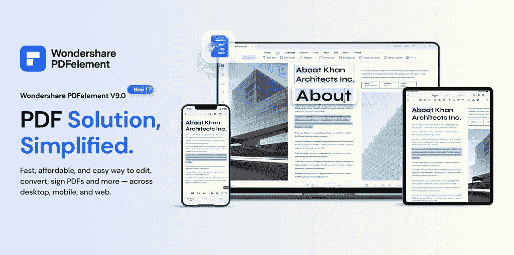
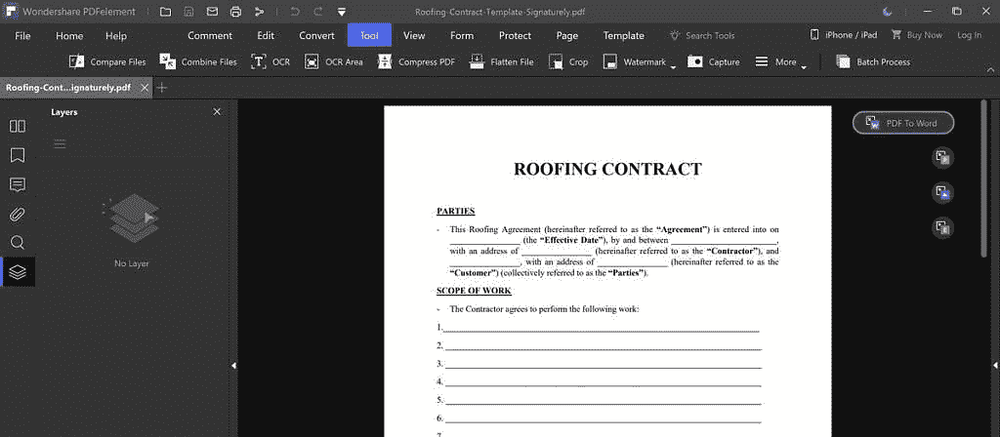
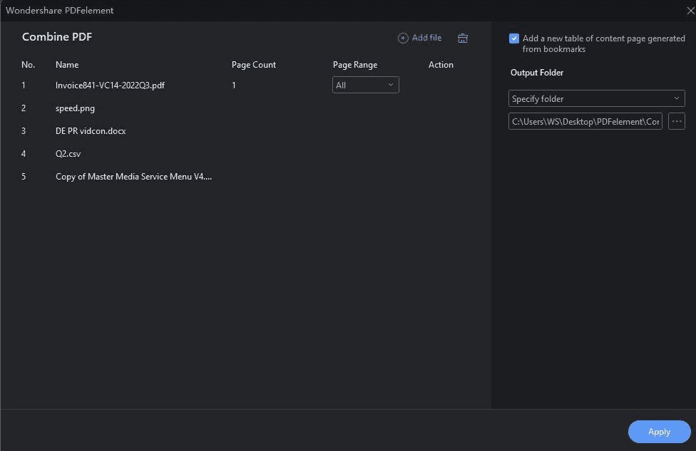
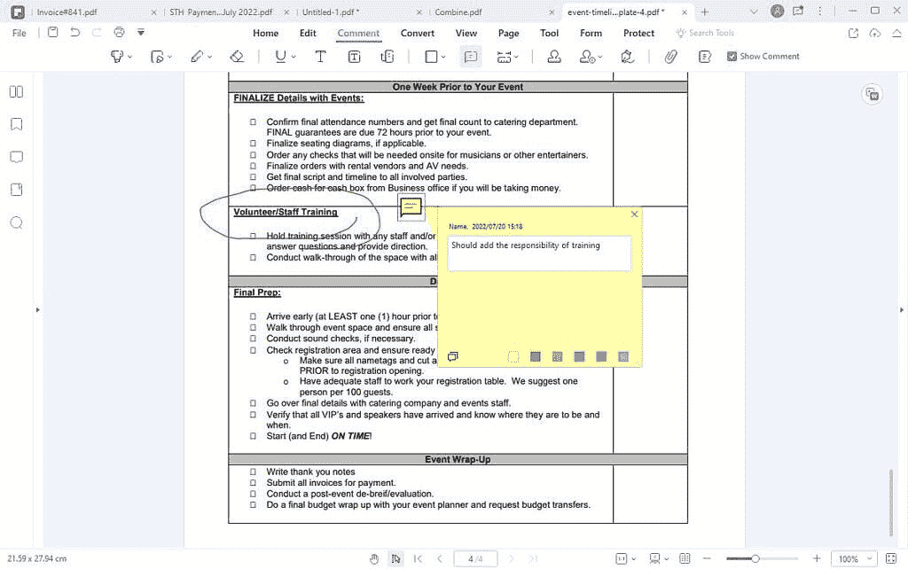
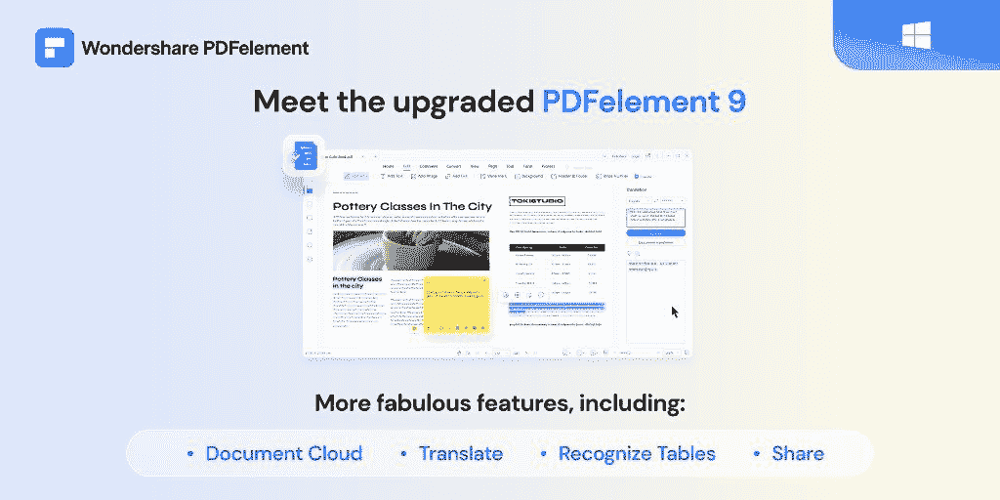
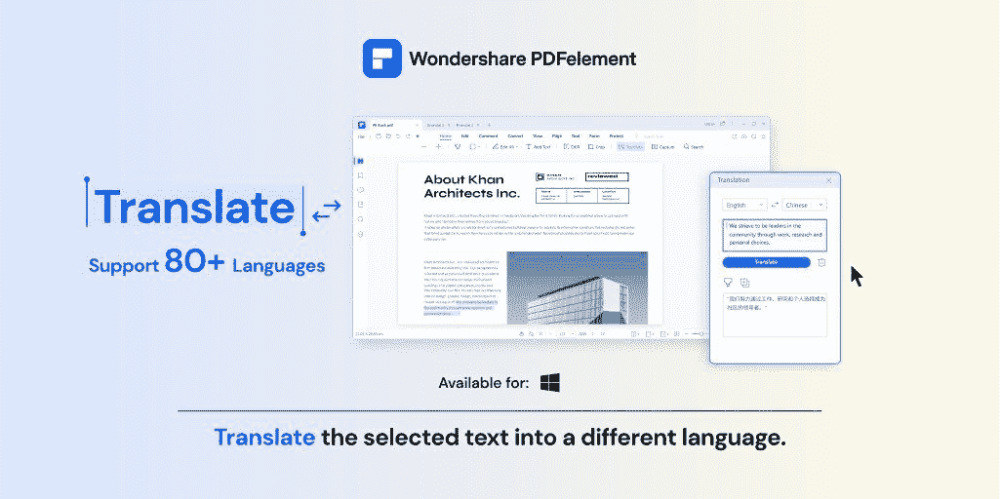
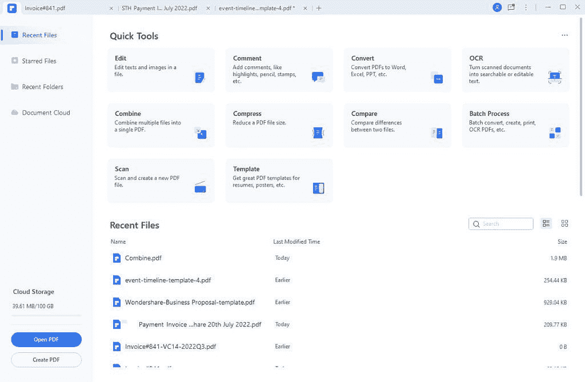

# Wondershare PDFelement 9 - PDF 编辑器:使用 PDF 的最明智选择

> 原文：<https://www.xda-developers.com/wondershare-pdfelement-9-pdf-editor-the-smartest-choice-to-work-with-pdfs/>

编辑、创建和管理 PDF 文件的最佳解决方案最近获得了重大更新，增加了大量新功能。PDFelement 9 减轻了处理 PDF 文件的所有痛苦，PDF 文件是出了名的难以处理。如果你在任何一种工作环境中，你都有可能以前处理过 PDF 文件。这经常让我们手忙脚乱地寻找打开、编辑、合并或签署 PDF 文档的方法。有了 [PDFelement 9](https://www.anrdoezrs.net/links/100122946/type/dlg/sid/UUxdaUeUpU42623/https://pdf.wondershare.com/?utm_source=other_media_sites&utm_medium=referral&utm_campaign=xdadevelopers-pe9) ，您将再也不用为这些类型的文件而烦恼了。

 <picture></picture> 

Wondershare PDFelement 9

## 轻松创建和修改 PDF 文件

Wondershare PDFelement 的目标是成为 PDF 文档的终极软件解决方案。通过将所有这些工具集成到一个软件中，PDFelement 增强了个体企业主、教育工作者、营销人员和各种不同职业的人的能力。该软件非常简单，任何人都可以使用它开始创建、查看、编辑和管理任意数量的 PDF 文件。

填写表单很容易，因为您可以使用 PDFelement 来处理税务、合同、登记表、医疗文档等等。您甚至可以使用内置工具快速创建自己的表单。填写并完成表单后，使用转换选项将文件转换为图像、word 文档或许多其他选项。

 <picture></picture> 

Wondershare PDFelement 9

您可以使用合并工具将多个不同的文件合并成一个 PDF。将图像、文本、数据表和图形添加到项目中，然后将它们全部合并到一个文件中。这是以易于通过电子邮件或聊天发送的格式创建商业报告的最佳方式。

 <picture></picture> 

Wondershare PDFelement 9

您可以在需要审阅的文件中随意添加注释，并将其与您的注释一起返还给发件人。这是记录需要对合同进行的更改或需要添加到学校项目中的注释的好方法。

 <picture></picture> 

Wondershare PDFelement 9

## PDFelement 9 有什么新功能？

由于 Wondershare 一直致力于为其软件提供新功能，PDFelement 在 7 月份进行了重大更新，引入了几个新工具来简化您的工作流程。此次更新重点关注了云中的文档管理，允许您轻松管理云中的文件，甚至创建链接来共享您的文档。整个过程现在比以往任何时候都更容易，因此您可以花更少的时间处理电子邮件附件。

 <picture></picture> 

Wondershare PDFelement 9

最新更新中的新优化有望加快文档加载速度。现在，您的文档渲染速度**提高了 30%**,可以节省宝贵的时间，尤其是对于那些处理大量 pdf 文件的用户。为了进一步改善您的工作流程，该软件现在有了**表格识别**。将数据表直接导入到文档中，并保持其格式。

利用**聚焦模式**，让签名过程更加干净。这隐藏了 Windows 工具栏，并为客户提供了不受干扰的体验。如果你不太擅长画你的签名，你现在可以使用**图像签名**工具。这将获取您完美签名的现有图像，并将其添加到文档中。现在，合同和协议每次都可以包含干净一致的签名。

 <picture></picture> 

Wondershare PDFelement 9

如果您与不同语言的人一起工作，使用新的**文档翻译**功能立即将您的 PDF 翻译成选定的语言。

## PDFelement 还能做什么？

PDFelement 9 不仅仅是一个 [PDF 编辑器](https://www.anrdoezrs.net/links/100122946/type/dlg/sid/UUxdaUeUpU42623/https://pdf.wondershare.com/?utm_source=other_media_sites&utm_medium=referral&utm_campaign=xdadevelopers-pe9)来帮助您转换、编辑和签署 PDF 文件，还提供了强大的功能，如 OCR(光学字符识别)和以合理的价格组织 PDF 工具。这些功能是:

*   OCR:它可以识别 PDF 中的文本，即使扫描的 PDF 是图像文件，也可以将其转换为可搜索和可编辑的文本。
*   组织 PDF 页面:使用 PDFelement 9，只需点击几下鼠标，即可轻松移动、复制、删除和拆分 PDF 页面。
*   提取 PDF 数据:从各种已填写的保险表格、发票和申请表中整齐地提取信息到一个格式整齐的表格中。
*   密码保护 PDF:设置密码或锁定 PDF 以保护其不被复制、编辑、打印和查看。

 <picture></picture> 

Wondershare PDFelement 9

## 免费试用

如果你想试用 PDFelement 看看它是否适合你的工作流程，你可以在购买之前先免费试用一下。该软件有个人版和团队版，这取决于你的需求。

 <picture></picture> 

Wondershare PDFelement 9

为了帮助你入门，你可以使用他们的 [YouTube 频道教程](https://www.youtube.com/c/PDFelement)来学习如何完成 PDFelement 的所有不同功能。他们免费上传所有教程，还有大量视频可以回答你对他们软件的任何问题。

立即免费试用并[下载 PDFelement](https://www.anrdoezrs.net/links/100122946/type/dlg/sid/UUxdaUeUpU42623/https://pdf.wondershare.com/?utm_source=other_media_sites&utm_medium=referral&utm_campaign=xdadevelopers-pe9) ！

我们感谢 Wondershare 赞助了这篇文章。我们的赞助商帮助我们支付与运行 XDA 相关的许多费用，包括服务器成本、全职开发人员、新闻撰稿人等等。虽然您可能会在门户内容旁边看到赞助内容(这些内容将始终被标记为赞助内容),但门户团队对这些帖子不承担任何责任。赞助内容、广告和 XDA 仓库完全由一个独立的团队管理。XDA 绝不会通过接受金钱来赞扬一家公司，或以任何方式改变我们的观点或看法，从而损害其新闻诚信。我们的意见不能被收买。