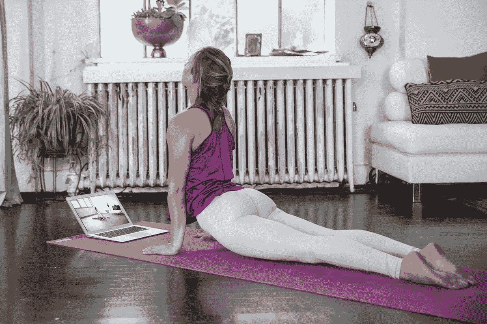
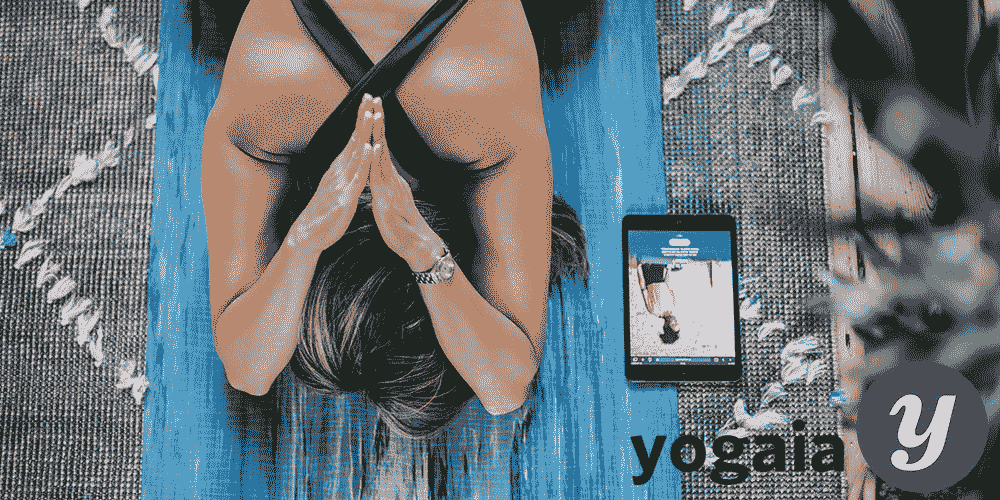
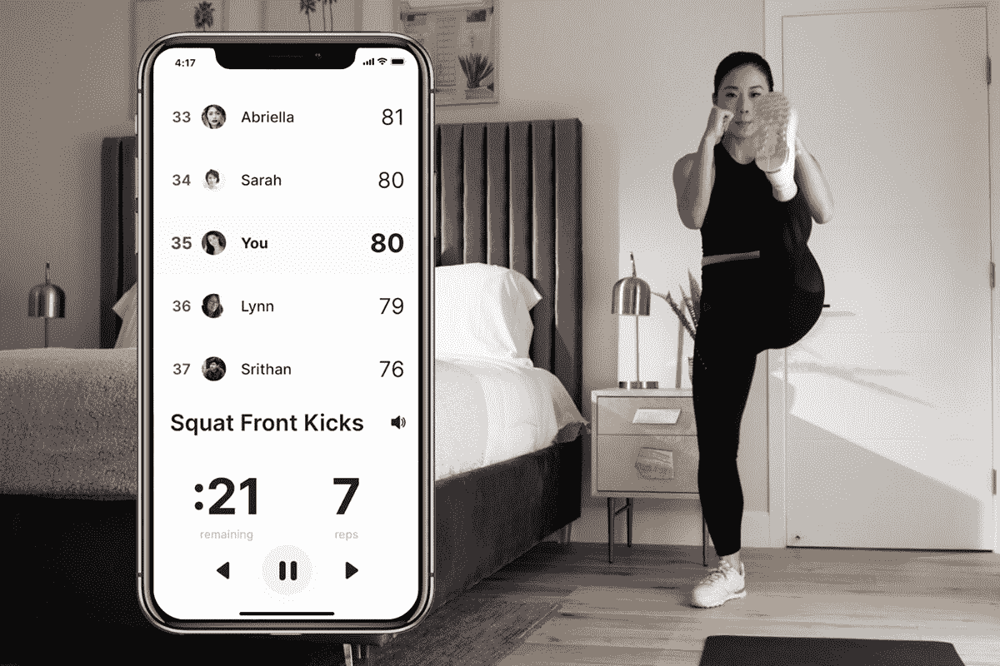
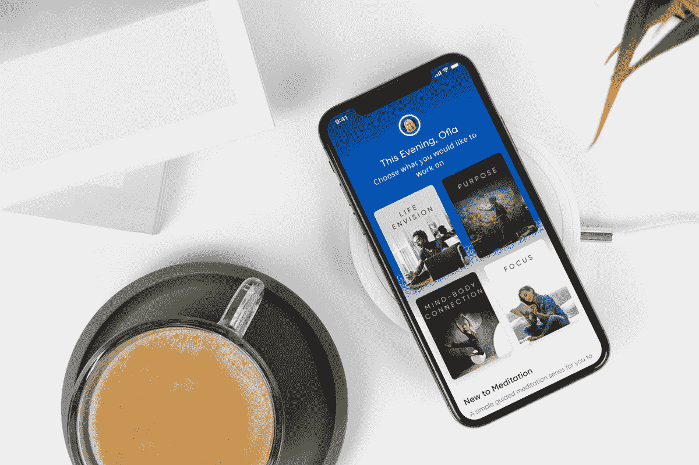
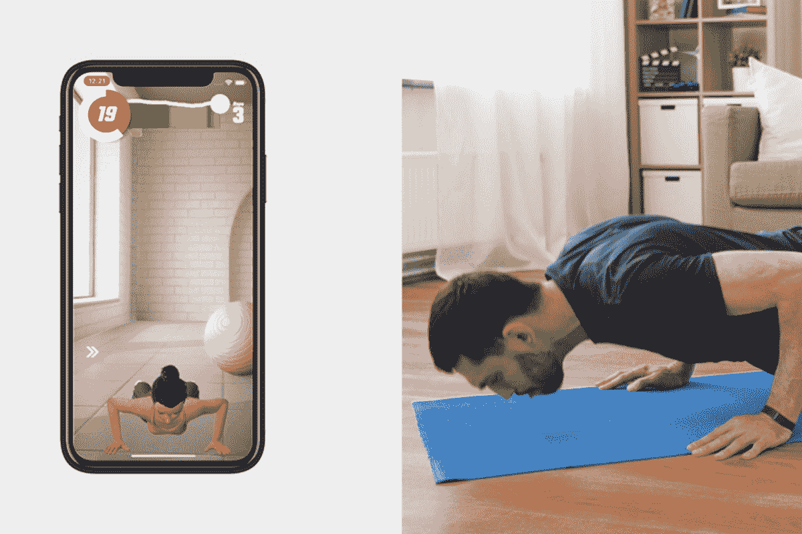

# 用健身应用程序上的 8 个惊人的交易来消除你今年的隔离 15

> 原文：<https://www.xda-developers.com/work-off-your-quarantine-15-this-year-with-8-amazing-deals-on-fitness-apps/>

在 2020 年的大部分时间里，我们都被困在室内，很有可能你全年都没有达到每日身体活动的推荐量。在疫情中努力保持健康可能很困难，但我们已经收集了九个 Android 健身应用程序的交易，在新年开始时将保持你的活动水平，并且使用 offer code HOLIDAY20 可以额外享受 20%的折扣。

[**YogaDownload 无限制:1 年订阅**](https://depot.xda-developers.com/sales/1-yr-of-yoga-download-unlimited?utm_source=xda-developers.com&utm_medium=referral&utm_campaign=1-yr-of-yoga-download-unlimited&utm_term=scsf-464411&utm_content=a0x1P000004YrpTQAS&scsonar=1)

有了 YogaDownload Unlimited，无论你是初学者还是进阶者，你都可以自由参加 1，500 多种瑜伽和健身课程，这些课程专为各种水平的技能而设计。坚持练习瑜伽负重将增强你的身体和精神，帮助你形成一个更平静、更集中的心态。

[trust pilot](https://www.trustpilot.com/review/www.yogadownload.com)5 分 4.7 分，超过 1200 条用户评论，很容易看出为什么 YogaDownload 被强烈推荐。

花 23.20 美元获得 Y[o 无限下载:1 年订阅](https://depot.xda-developers.com/sales/1-yr-of-yoga-download-unlimited?utm_source=xda-developers.com&utm_medium=referral&utm_campaign=1-yr-of-yoga-download-unlimited&utm_term=scsf-464411&utm_content=a0x1P000004YrpTQAS&scsonar=1)(注册。119 美元)带促销代码 HOLIDAY20。

[**Yogaia 互动瑜伽课程:终身订阅**](https://depot.xda-developers.com/sales/lifetime-of-yogaia?utm_source=xda-developers.com&utm_medium=referral&utm_campaign=lifetime-of-yogaia&utm_term=scsf-464412&utm_content=a0x1P000004YrpTQAS&scsonar=1)

在最近的记忆中，这可能是压力最大的一年，但是每天练习瑜伽有助于缓解你的压力，让你在办公桌前或沙发上呆上几个小时后保持灵活。通过订阅 Yogaia，您可以获得 1，000 多个广播健身课程，包括瑜伽、普拉提、拉伸、泡沫翻滚等，每个课程的时长从 5 分钟到 1 小时不等。此外，您还可以参加现场互动会议

花 239.20 美元获得 [Yogaia 互动瑜伽课程:终身订阅](https://depot.xda-developers.com/sales/lifetime-of-yogaia?utm_source=xda-developers.com&utm_medium=referral&utm_campaign=lifetime-of-yogaia&utm_term=scsf-464412&utm_content=a0x1P000004YrpTQAS&scsonar=1)(注册。$399)带促销代码 HOLIDAY20。

[**Onyx Home 健身 App:终身订阅**](https://depot.xda-developers.com/sales/onyx-home-workout-app-lifetime-subscription?utm_source=xda-developers.com&utm_medium=referral&utm_campaign=onyx-home-workout-app-lifetime-subscription&utm_term=scsf-464410&utm_content=a0x1P000004YrpTQAS&scsonar=1)

如果你花很多时间在手机上，你也可以把它变成你的私人健身助手。使用 Onyx 应用程序，您可以将手机摄像头用作 3D 捕捉系统，以计算您的重复次数，并在您锻炼时监控您的状态。它提供根据您的表现个性化的音频锻炼，并在锻炼后为您提供详细的统计数据，以说明您随着时间的推移而取得的进步。

获得一个 [Onyx 家庭锻炼应用程序:终身订阅](https://depot.xda-developers.com/sales/onyx-home-workout-app-lifetime-subscription?utm_source=xda-developers.com&utm_medium=referral&utm_campaign=onyx-home-workout-app-lifetime-subscription&utm_term=scsf-464410&utm_content=a0x1P000004YrpTQAS&scsonar=1),价格 63.99 美元(注册。300 美元)和促销代码 HOLIDAY20。

[**BetterMe 家庭健身&饮食:终身订阅**](https://depot.xda-developers.com/sales/betterme-lifetime-subscription?utm_source=xda-developers.com&utm_medium=referral&utm_campaign=betterme-lifetime-subscription&utm_term=scsf-464409&utm_content=a0x1P000004YrpTQAS&scsonar=1)

说到保持健康，锻炼只是战斗的 20%;其余的都在你的饮食中。BetterMe 为您提供最大限度地实现这两者所需的一切，包括由美味、易于制作的食谱组成的膳食计划，以及帮助您实现健身目标的个性化锻炼旅程，无论是燃烧脂肪还是增加肌肉。

花 31.99 美元获得 [BetterMe 家庭锻炼&饮食:终身订阅](https://depot.xda-developers.com/sales/betterme-lifetime-subscription?utm_source=xda-developers.com&utm_medium=referral&utm_campaign=betterme-lifetime-subscription&utm_term=scsf-464409&utm_content=a0x1P000004YrpTQAS&scsonar=1)(注册。1200 美元)和促销代码 HOLIDAY20。

[**根深蒂固的焦虑&冥想 App: 1 年订阅**](https://depot.xda-developers.com/sales/rootd-anxiety-depression-meditation-app-1-year-of-premium?utm_source=xda-developers.com&utm_medium=referral&utm_campaign=rootd-anxiety-depression-meditation-app-1-year-of-premium&utm_term=scsf-464415&utm_content=a0x1P000004YrpTQAS&scsonar=1)

如果你在恐慌或焦虑中挣扎，Rootd 可以帮助你。它提供了一些功能，如引导呼吸工具、身体扫描冥想和紧急联系按钮，以便在恐慌发作时为您提供支持。你还会发现引导可视化，日志和课程来跟踪你的进展，因为你要长期解决焦虑。

Rootd 是本次综述中最受欢迎的应用之一，目前在谷歌 Play 商店上拥有 4.7 颗星的。

获得一个[根深蒂固的焦虑&冥想应用:一年订阅](https://depot.xda-developers.com/sales/rootd-anxiety-depression-meditation-app-1-year-of-premium?utm_source=xda-developers.com&utm_medium=referral&utm_campaign=rootd-anxiety-depression-meditation-app-1-year-of-premium&utm_term=scsf-464415&utm_content=a0x1P000004YrpTQAS&scsonar=1)20.79 美元(注册。59 美元)带促销代码 HOLIDAY20。

[**奥姆瓦纳冥想 App:终身订阅**](https://depot.xda-developers.com/sales/omvana-meditation-app-lifetime-subscription?utm_source=xda-developers.com&utm_medium=referral&utm_campaign=omvana-meditation-app-lifetime-subscription&utm_term=scsf-464416&utm_content=a0x1P000004YrpTQAS&scsonar=1)

健康的头脑和健康的身体一样重要，所以你应该以同样的精力练习正念。Omvana 是一个冥想应用程序，它将教你如何在生活中实施冥想，提供指导冥想课程、曲目、课程等。这些冥想涉及各种关键主题，如更好的睡眠、注意力和生产力，以及清晰的视野。

以 79.99 美元的价格获得一个 [Omvana 冥想应用程序:终身订阅](https://depot.xda-developers.com/sales/omvana-meditation-app-lifetime-subscription?utm_source=xda-developers.com&utm_medium=referral&utm_campaign=omvana-meditation-app-lifetime-subscription&utm_term=scsf-464416&utm_content=a0x1P000004YrpTQAS&scsonar=1)(注册。299 美元)带促销代码 HOLIDAY20。

[**Fitness Ally 高级人工智能健身程序:1 年订阅**](https://depot.xda-developers.com/sales/fitness-ally-premium-ai-powered-workouts-1-year-subscription?utm_source=xda-developers.com&utm_medium=referral&utm_campaign=fitness-ally-premium-ai-powered-workouts-1-year-subscription&utm_term=scsf-464414&utm_content=a0x1P000004YrpTQAS&scsonar=1)

谁知道人工智能会进入健身行业？Ally 应用程序向您介绍 Allie，这是一个人工智能助手，它将在您健身时为您提供实时指导、反馈和激励。最重要的是，你不需要任何重量或特殊设备来锻炼 Allie 你所需要做的就是在锻炼时将你的智能手机摄像头对准你自己。

以 15.99 美元的价格获得 [Fitness Ally 高级人工智能训练:1 年订阅](https://depot.xda-developers.com/sales/fitness-ally-premium-ai-powered-workouts-1-year-subscription?utm_source=xda-developers.com&utm_medium=referral&utm_campaign=fitness-ally-premium-ai-powered-workouts-1-year-subscription&utm_term=scsf-464414&utm_content=a0x1P000004YrpTQAS&scsonar=1)(注册。59 美元)带促销代码 HOLIDAY20。

[**【Jillian Michaels:健身 App(终身订阅)**](https://depot.xda-developers.com/sales/jillian-michaels-the-fitness-app-lifetime-subscription?utm_source=xda-developers.com&utm_medium=referral&utm_campaign=jillian-michaels-the-fitness-app-lifetime-subscription&utm_term=scsf-464413&utm_content=a0x1P000004YrpTQAS&scsonar=1)

Jillian Michaels 是世界上最广为人知的健身名人之一，现在你可以使用健身应用程序每天与她一起训练。通过终身订阅，您可以获得从初级到高级的 800 多个高清视频练习。健身应用程序让你调整一切以适应你的需求，从运动强度到运动间隔时间。

购买 [Jillian Michaels:健身应用(终身订阅)](https://depot.xda-developers.com/sales/jillian-michaels-the-fitness-app-lifetime-subscription?utm_source=xda-developers.com&utm_medium=referral&utm_campaign=jillian-michaels-the-fitness-app-lifetime-subscription&utm_term=scsf-464413&utm_content=a0x1P000004YrpTQAS&scsonar=1)，价格为 149.99 美元(注册$449).

在 2021 年寻找更多保持活力的方法？您还可以参加[完全家庭健身房赠品](https://depot.xda-developers.com/sales/100-entries-to-win-the-ultimate-fitness-giveaway-donate-to-charity?utm_source=xda-developers.com&utm_medium=referral&utm_campaign=100-entries-to-win-the-ultimate-fitness-giveaway-donate-to-charity&utm_term=scsf-459436&utm_content=a0x1P000004YrpTQAS&scsonar=1)，有机会赢得价值超过 5000 美元的健身器材。获胜者将获得一辆 Peloton Bike+，一台 Theragun Prime，一张购买健身服装的 100 美元礼品卡，以及更多。

你所要做的就是向 Playing For Change 捐款，这样你就有机会获得完整的家庭健身房赠品。你捐得越多，你赢的机会就越大，而且就在这一周，当你捐款时，你将获得双倍的[参赛作品](https://depot.xda-developers.com/sales/100-entries-to-win-the-ultimate-fitness-giveaway-donate-to-charity?utm_source=xda-developers.com&utm_medium=referral&utm_campaign=100-entries-to-win-the-ultimate-fitness-giveaway-donate-to-charity&utm_term=scsf-459436&utm_content=a0x1P000004YrpTQAS&scsonar=1)！

价格可能会变化。