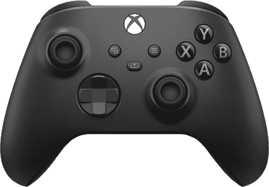

# 抢到一个 Xbox 系列 X？只需 40 美元就能获得一个无线控制器！

> 原文：<https://www.xda-developers.com/xbox-wireless-game-controller-black-friday-sale-best-buy/>

# 抢到一个 Xbox 系列 X？在黑色星期五交易期间，只需 40 美元即可获得一个无线控制器！

Xbox 控制器兼容下一代 S 系列和 X 系列游戏机以及 Xbox One，目前仅售 40 美元。抓住它！

Xbox 系列 X 和 [PlayStation 5](https://www.xda-developers.com/playstation-5-restocks/) 是目前最热门的下一代游戏机之一。由于这两款游戏机都遭遇了库存问题以及前所未有的需求，你可能还不能得到一台游戏机。然而，如果你这样做了，那么你可能正在尽情享受你的下一代体验。如果你买了一台 Xbox Series X 并且正在寻找一个额外的控制器，或者即使你有一台 Xbox One 并且想要一个新的控制器，那么我们可以满足你。百思买目前仅售 40 美元的 Xbox 无线控制器，低于通常 60 美元的零售价。

 <picture></picture> 

Microsoft Xbox Wireless Controller

##### 微软 Xbox 无线控制器

Xbox 无线控制器兼容 Xbox Series X、Xbox Series S 和 Xbox One 系列游戏机，以及 PC 和 Android 设备，现在只需 40 美元就可以买到一台。

Xbox 无线控制器实际上是 Xbox 系列 S 和 Xbox 系列 X 都附带的型号，这就是为什么我们非常重视这些特定型号，但它也完全兼容旧的 Xbox One、Xbox One S 和 Xbox One X 游戏机，因为它是适用于这两代游戏机的标准 Xbox 控制器。这意味着您可以获得更新的 d-pad 和新型号附带的更简洁的设计。

当然，Xbox 控制器也因与 PC 兼容而闻名，所以如果你是 PC 游戏玩家，并且你想要一个能完成工作而不是只使用键盘和鼠标的控制器(一些游戏在控制器上玩起来更舒服)，你也可以得到它。

Xbox 控制器的黑色和白色配色现在的零售价都是 40 美元，而“震惊蓝”型号的价格要稍微贵一些，为 45 美元。所有这些都比之前 60 美元的零售价便宜得多，即使你没有 Xbox，它们也是令人惊叹的控制器，所以现在就行动吧，趁存货售完。