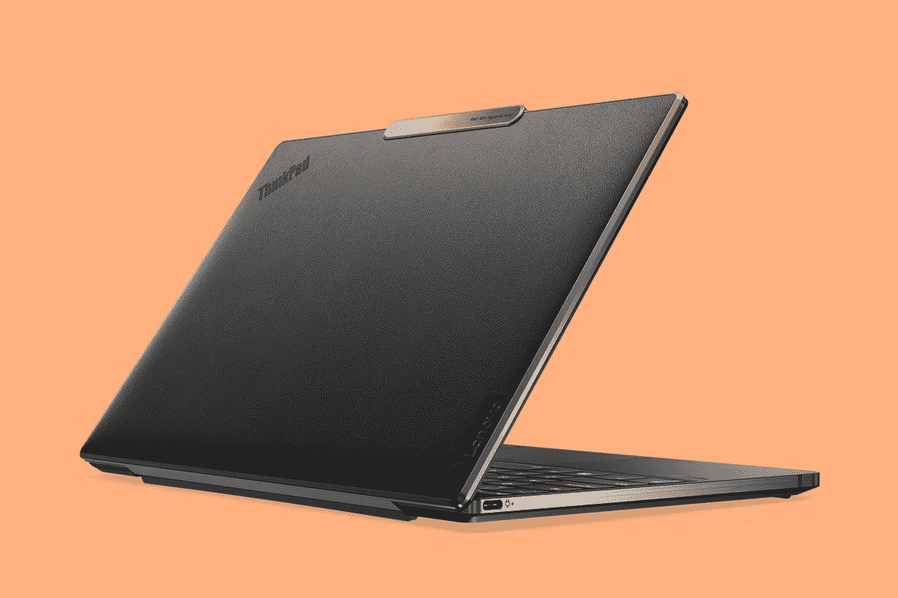

# 关于 USB 标准、速度和端口类型，您需要了解的一切

> 原文：<https://www.xda-developers.com/xdaandroid-podcast-episode-8-death-by-usb-ports-life-saving-patches/>

USB 或“通用串行总线”是当今最古老和最流行的接口之一。虽然它最初是作为一个计算机端口推出的，但现在它几乎出现在每一件技术产品上，包括智能手机、游戏机、相机等。以某种形式。制造 USB 的主要目的是为个人电脑提供一个标准的外围设备连接。今天，USB 名副其实，这要归功于它的广泛接受和各种支持的硬件和软件。让我们看看 USB 的简史，并列出所有不同类型的连接器和标准。

## USB 是怎么产生的？

USB 的发展始于 1994 年，其目标是制造一个单一的连接器，基本上可以取代 PC 上的许多连接器。USB 的目的还在于为可以通过 USB 连接的所有设备带来更简单的软件配置，为外部设备提供更快的数据速率，并解决现有接口的可用性问题。不过，USB 不是一个人的发明。这是一个集体努力，包括总共七家公司，即康柏、DEC、IBM、英特尔、微软、NEC 和北电。由阿杰伊·巴特领导的团队在英特尔致力于该标准，1995 年生产了第一个支持 USB 的集成电路。

### USB 1.0

称为 USB 1.0 的第一个规范于 1996 年 1 月首次亮相，提供 1.5 Mbps(低速)和 12 Mbps(全速)的数据传输速度。之所以决定增加双速配置，是因为它既可以支持打印机和磁盘驱动器等高速设备，也可以支持键盘和鼠标等低成本外设。USB 1.1 实际上是第一个广泛使用的规范，因为它于 1998 年 9 月首次出现在 Apple iMac 上。许多制造商效仿苹果，开始生产带有 USB 端口的传统免费电脑。

### USB 2.0 和 USB 3.0

2000 年 4 月，USB 2.0 规范在得到 [USB 实现者论坛](https://www.usb.org/) (USB-IF)的同意后公布。它于 2001 年推出。惠普、英特尔、朗讯科技(诺基亚)、NEC 和飞利浦推动了更高的数据传输速率，新标准带来了高达 480Mbps 的速度。然后，我们看到了 2008 年 11 月 12 日发布 USB 3.0，进一步将数据传输速度提高到 5Gbps，这也被称为 SuperSpeed。新标准还专注于降低功耗、增加功率输出，并提供与 USB 2.0 的向后兼容性。第一套采用 USB 3.0 的设备于 2010 年 1 月问世。

### USB 3.1 第 1 代和第 2 代

USB 3.1 规范于 2013 年 7 月首次公布，这是事情开始变得有点混乱的地方。推出了两个版本，USB 3.1 Gen 1 和 USB 3.1 Gen 2。虽然第一代保留了 USB 3.0 的 5Gbps(超高速)传输模式，但第二代引入了最大数据信号传输速率为 10Gbps 的超高速+传输模式。2017 年 9 月，USB 3.2 规范发布，再次带来了命名方案的变化。USB 3.2 Gen 1 实际上与 USB 3.1 Gen 1 相同，USB 3.2 Gen 2 是新的 USB 3.1 Gen 2，USB 3.2 Gen 2x2 是最新和最快的产品，速度高达 20Gbps。

### USB4 和 USB4 版本 2.0

 <picture></picture> 

Lenovo ThinkPad Z13

最新标准的官方名称是 USB4(不管出于什么原因，不是 USB 4)，于 2019 年推出，首批 [USB4 设备](https://www.xda-developers.com/best-usb4-laptops/)将于 2021 年和 2022 年到达。USB 3.1 和 3.2 以及整个第 1 代和第 2 代术语变得非常混乱，USB-IF 正试图用 USB4 来消除这一点，其市场营销将取决于其数据传输速度，而不是它的版本。USB4 有两种类型:20Gbps 和 40Gbps，USB-IF 希望制造商将他们的 USB 设备品牌化，而不仅仅是 USB4。

第一批 USB4 2.0 设备最早要到 2023 年底才会问世。

USB4 还有一个附加点:雷电。USB4 的基础是英特尔的旧雷电 3 协议，自然地，USB4 在某种程度上兼容 Thunderbolt——重点是*有点*。USB4 设备和电缆可以是 20Gbps 或 40Gbps，而 Thunderbolt 4 要求 40Gbps，因此并非所有 USB4 端口和电缆都与 Thunderbolt 等效。

USB4 版本 2.0 的规范于 2022 年底发布(使 USB 对每个人来说更加混乱)，并将 USB4 的带宽从 40Gbps 增加到 80Gbps，可选的 120Gbps 模式仅在一个方向上工作，另一个方向只有 40 Gbps 的带宽。这种 120Gbps 模式适用于连接的一端需要接收比另一端多得多的数据的情况，例如使用需要大量数据来显示完整细节图像的高分辨率显示器。由于规范最近才出来，第一批 USB4 2.0 设备最早要到 2023 年底才会出来。

### Thunderbolt

与 USB 标准不同，它以普遍性和被接受为“标准”而自豪，Thunderbolt 是由英特尔开发和许可的标准。然而，雷电 3 基本上是给了 USB-IF，并被用来创建 USB4，所以现在两者之间的关系是模糊的。它是一个跨平台的数据和电源传输标准，但设备需要通过认证才能使用该标准，英特尔的标准比 USB-IF 的标准严格得多。

Thunderbolt 协议通常用于笔记本电脑，有时也用于台式机，可用于通过 USB-C 端口连接兼容 [DisplayPort](https://www.xda-developers.com/displayport-alt-mode-2-0-allow-16k-video-output-over-usb-4-type-c-ports/) 的设备，包括外部显示器以及 PCI Express (PCIe)外设，包括外部显卡、硬盘、Wi-Fi 或以太网连接器。当前一代协议 Thunderbolt 4 支持高达 40Gbps 的上行或下行带宽。与上一代雷电 3 相比，新版本带来了改进的 4K 显示支持(从一个 4K 显示器到两个)，PCIe 带宽增加了一倍，并保证了 40Gbps 的带宽，这对于雷电 3 是可选的。

下一代 Thunderbolt 即将问世。

于是有了 USB 和 Thunderbolt，USB4 是基于雷电 3 的，后来被 Thunderbolt 4 继承了。如果你感到困惑，我们不怪你。你需要知道的是，USB4 在性能方面没有太多保证，而 Thunderbolt 4 承诺更多。虽然 USB4 基于雷电 3，但这并不意味着每个 USB4 设备、端口和电缆都具有与任何雷电 3 或 4 连接相同的功能和性能。

下一代 Thunderbolt 也即将问世，Thunderbolt 5 的目标是将带宽提高到 80Gbps，是 Thunderbolt 4 和雷电 3 的 40Gbps 版本的两倍。但是，80Gbps 是双向需要等量带宽的设备的速度。一些设备可以在一个方向上拥有 120Gbps 的带宽，而在另一个方向上只有 120Gbps 的带宽，如 USB4 2.0。这对显示器甚至存储设备都很有用。在撰写本文时，Thunderbolt 5 还没有发布日期，尽管在 2023 年或 2024 年晚些时候推出是可行的。

## USB 连接器和端口

在我们谈论各种类型的 USB 端口和连接器之前，我们先来谈谈连接器和端口的区别。端口是您的设备(如智能手机或 PC)上的端口。它是你插入电缆或外部设备的地方，比如说一个拇指驱动器。连接器通常出现在插入端口的电缆上。这意味着您需要一个匹配的端口供连接器插入。人们还需要理解，USB 标准依赖于连接器和端口的组合。端口/连接器越新，它可以采用的标准就越新。话虽如此，也有制造商为了节省成本而将较旧的 USB 标准应用于较新的端口/连接器的情况。

**USB-A**

第一个扁平的矩形连接器仍然是 PC、游戏机、电视等设备上的常见景象。多年来，它在高效传输数据和电源方面表现出色，目前提供 USB 3.2 标准。它在公交专用道和换乘速度方面进行了升级，但总体而言，设计保持不变。

**USB-B**

USB-B 不再那么常见，但您可能仍然会在大型设备上看到此端口，如扫描仪或打印机以及某些音频设备。该端口有一个方方正正的外观，而电缆的另一端很可能有一个 USB-A 端口来连接 PC。

**迷你 USB**

现在，这是一个较小的端口，但它是基于 USB-B 端口。它主要用于从相机和 MP3 播放器等设备充电和传输数据，尽管现在已经不太常见了。也有 A 型版本，但两者都很快被一个更小的版本，微型 USB 所取代。

**微型 USB**

Micro-USB 是最受欢迎的 USB 端口之一，因为它被用于智能手机、平板电脑和各种其他便携式设备和配件。虽然 USB-C 端口正在被淘汰，但您仍然可以找到各种仍然依赖于该端口的设备。

**USB-C**

这是当前的标准，也是第一个可以一次性正确插入的 USB 端口，因为它是可逆的。除了提供更快的数据和电源传输速度，它还提供显示器连接，使其成为完美的通用端口。你可以在智能手机、笔记本电脑、平板电脑、耳机等几乎所有新时代设备上看到这个端口。它有可能提供 100 瓦的功率，使其适合为包括笔记本电脑在内的各种设备充电。这也是 Thunderbolt 标准的新一代连接器，提供 40Gbps 和 4K 视频输出。

## 功率输出

现在，除了传输数据，USB 还被用于给设备充电。在 USB 3.1 之前，人们可以获得的最大功率是 USB Type-A 的 5V/900mA。随后是 USB 快速充电，这是一个新标准，将速度提高到 5V/1.5A。这些充电速度也适用于小型设备和某些智能手机。然而，随着技术的进步和对更高电池充电速度的要求，USB-IF 推出了 USB 电源传输，现在的版本为 3.1。它已经成为行业标准的开放规范，可以通过最新的 3.1 更新提供高达 240 瓦的高速充电，具体取决于设备。这可以用来通过两端的 USB-C 连接器为从智能手机到笔记本电脑的任何东西充电。

* * *

USB 端口终于名副其实了。经过一年来在硬件和软件方面的各种修改，我们现在可以说 USB(感谢 Type-C)确实是一个普遍接受的标准。它不仅可以高速传输数据和电力，甚至可以用来输入或输出视频。难怪连苹果都在慢慢远离，用 USB Type-C 代替它的 Lightning 连接器。