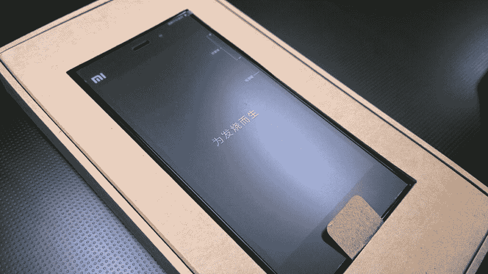
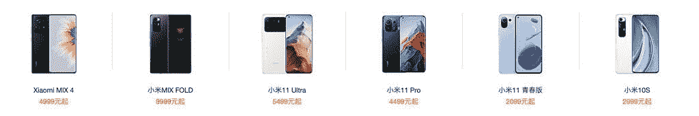

# 再见小米，你好小米:未来小米产品不会带有小米品牌

> 原文：<https://www.xda-developers.com/xiaomi-ditches-mi-branding/>

**更新 1(美国东部时间 08/24/2021 @ 04:50AM):**小米已经提供了一份官方声明，并对这一公告进行了更多澄清。[点击这里了解更多信息。](#update1)文章发表于 2021 年 8 月 23 日，下面保留。

作为一名科技媒体的美国人，我很难理解小米在如此短的时间内变得有多庞大。小米今年成为了[世界头号智能手机品牌](https://www.xda-developers.com/xiaomi-top-smartphone-brand-globally/)，但他们在美国的存在微乎其微，运营的网站甚至不提供该品牌最知名的产品:智能手机。小米是智能手机世界中最典型的价值品牌——他们的产品物超所值，而且[无论价位如何，人人都有一款智能手机](https://www.xda-developers.com/best-xiaomi-phones/)。

为了使其产品与众不同，小米将其产品分为多个子品牌，其中最著名的是“米”现在，在推出第一款带有 mi 品牌的智能手机十年后，小米准备做出一个大的改变:它将从产品名称中删除“Mi”。这种品牌的变化始于该公司最近发布的智能手机 MIX 4，该公司的一名代表告诉 T2 XDA，其所有即将推出的产品都将效仿。

尽管该公司以智能手机闻名，但小米也销售智能家居、生活方式和计算类别的许多产品，包括电视、笔记本电脑、冰箱、空气煎锅、智能手表、滑板车、机器人、吹风机等等。如今，这些产品中的大多数都带有 Mi 品牌，但这种情况会随着他们推出的任何新产品而改变。

## 再见米，你好小米

有趣的事实:小米的第一个带有 mi 品牌的产品实际上不是智能手机，但它肯定与智能手机有关。该公司的第一款产品实际上是 MIUI，这是一款基于 Android 的操作系统，目前已经升级到 12.5 版本。XDA 论坛的早期访客可能还记得社区认为 MIUI 是[这个星球上最热门的](https://forum.xda-developers.com/t/rom-android-2-2-miui-for-desire-and-nexus-one-insane-complete-ui-overhaul.787877/)。许多人当时没有意识到的是，MIUI 背后的开发人员有着比维护一个 Android 分支更远大的抱负。

\ r \ nht TPS://www . YouTube . com/watch？v=Or-9T44Bt7M\r\n

2011 年末，小米推出了其首款智能手机 Mi 1。这款智能手机包装了旗舰(当时)规格，包括高通的双核骁龙 S3 芯片组，1 GB 内存和 4 英寸 854x480 分辨率的液晶面板。当然，它也在 Android 2.3 姜饼之上运行了 MIUI。

在接下来的几年里，小米继续在其 mi 系列中推出新的智能手机，所有这些手机都只在中国销售。2013 年末，小米从谷歌挖走了雨果·巴拉，他当时是 Android 的副总裁兼产品发言人。在巴拉的指导下，小米扩展到了亚洲其他地区，包括新加坡，但更重要的是印度，这个国家已成为小米全球成功的关键。小米在中国以外推出的第一批产品是小米 3 和红米 2，后者是该公司红米子品牌的第二款产品，自那以来，红米子品牌发展迅速，对小米的全球战略至关重要。

 <picture></picture> 

The Xiaomi Mi3 in its recycled cardboard packaging. Source: [Roland Tanglao on Flickr](https://www.flickr.com/photos/roland/14721618507)

小米 3 和红米 2 的全球发布为小米打开了闸门，他们迅速扩展到更多市场，推出更多智能手机，并扩展到其他产品类别。[自 2017 年巴拉离开](https://www.xda-developers.com/hugo-barra-to-depart-xiaomi-return-to-silicon-valley/?)以来，小米上升到印度智能手机市场的首位，据报道[在欧洲取代了三星](https://www.xda-developers.com/xiaomi-overtook-samsung-europe-q2-2021/)。众多因素促使小米成为全球[最大的智能手机品牌](https://www.xda-developers.com/xiaomi-top-smartphone-brand-globally/)，包括华为的衰落和新冠肺炎引发的供应限制，但我并不惊讶于小米终于在今年登顶。小米制造非常好的产品，没有一个领域他们害怕竞争，无论是[廉价手机](https://www.xda-developers.com/redmi-10-launch/)、[超高端旗舰手机](https://www.xda-developers.com/xiaomi-mi-11-ultra-review/)、[概念手机](https://www.xda-developers.com/xiaomi-mix-4-hands-on/)，还是[可折叠手机](https://www.xda-developers.com/xiaomi-mi-mix-fold-hands-on/)。

小米联合创始人兼 CEO 雷军曾经[评论过](https://tech.qq.com/a/20110714/000278.htm)公司名称的由来。他说，“米”代表两件事:“移动互联网”和“不可能完成的任务。”小米将自己视为一家致力于完成“不可能”任务的移动互联网公司，这是你会在该公司的[产品](https://www.xda-developers.com/xiaomi-80w-wireless-charger-airpower-clone/) [发布会](https://www.xda-developers.com/xiaomi-mi-air-charge-wireless-charging/)中经常听到的。“小米”这个词本身翻译成英文就是“小米”，一种小颗粒作物，而“Xiao”翻译成“小”因此，雷军将公司的名字与一粒米对一个佛教徒来说就像一座山一样伟大的概念联系在一起，这意味着公司在向上发展之前专注于更小的事情。

现在小米已经成为世界顶级智能手机品牌，也许他们认为是时候让客户将他们的产品与公司的名字联系起来，而不仅仅是“米”似乎在中国，该公司已经在销售名称中没有“Mi”的设备，因此这一举动也使他们的全球产品命名策略符合他们的中国策略。尽管如此，不要认为这会消除公司每个市场的产品品牌的混乱，因为这仍然是一个巨大的混乱。

 <picture></picture> 

Screenshot of Xiaomi's Chinese web store, showing the product names for several smartphones.

Mi、Redmi 和 POCO 是小米目前对其所有产品进行分类的三个品牌。很快，这个名单将变成小米、红米和 POCO，将话题从子品牌与独立品牌(红米和 POCO 都是几年前从小米剥离出来的)转变为三家相互竞争的公司，或者至少是这种假象。

* * *

## 更新:小米声明

小米通过他们的发言人提供了以下声明:

*从 2021 年 Q3 开始，小米的产品系列“mi”将更名为“小米”。这一变化将统一我们的全球品牌形象，并缩小品牌与其产品之间的认知差距。这一变化可能需要一段时间才能在所有地区生效。*

随着新品牌标识的引入，母品牌下将出现两个不同的产品系列。小米产品代表了技术的巅峰，提供了优质的体验。Redmi 产品以更容易接受的价格带来了重大创新，并面向年轻受众。这种差异也反映在我们更新的标志上，小米和红米标志都在母品牌标志下。

随着时间的推移，产品系列命名惯例——小米和红米——也将应用于我们的生态系统和物联网产品。

* * *

*特色图片:小米旧 logo*