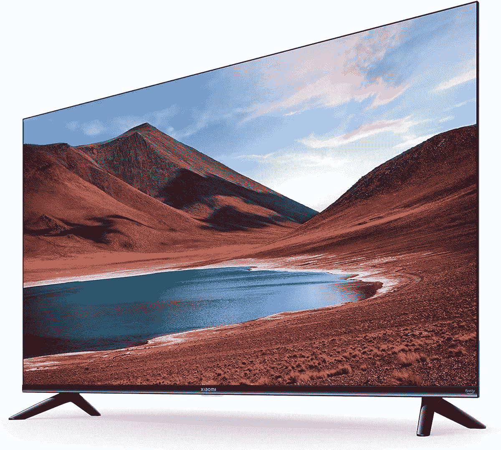

# 首批小米 Fire 电视以特价在英国上市

> 原文：<https://www.xda-developers.com/xiaomi-f2-fire-tv-uk-launch/>

随着小米首批基于亚马逊平台的产品的到来，Fire TV 生态系统现在在英国变得更大了。F2 现在有三种尺寸可供订购，第一周价格特别优惠。Fire TV 一直是远离亚马逊自己的硬件和不太知名的品牌的缓慢燃烧器，但现在看来，这种情况可能开始改变。

但是为什么是现在？过去有很多关于谷歌及其在电视上对 Android 的控制的讨论。Android 兼容性承诺有效地阻止了硬件制造商制造任何基于 Android 的竞争设备，如果他们也想访问 Google Play 和该公司的应用程序和服务的话。早在 2020 年就有[报道称，公司实际上被吓得不敢建造消防电视设备，这是一个“公开的秘密”。整件事甚至促使](https://www.protocol.com/google-android-amazon-fire-tv)[反垄断调查](https://www.xda-developers.com/india-antitrust-investigation-google-smart-tv-dominance/)。

那个先不说，那么新的小米 F2 呢？理论上，这一切听起来相当不错。有 43 英寸、50 英寸和 55 英寸的电视可供选择，最小的最初售价仅为 339 英镑。就价格而言，这些都是设备齐全的电视。

分辨率当然是 4K，F2 也支持 HDR10。四个 HDMI 2.1 端口以及内置蓝牙和 USB 提供了丰富的连接能力。该面板本身拥有 90%的 DCI-P3 色彩和 6 毫秒的响应时间，因此它对于主机游戏来说听起来相当不错。尽管在最新一代上限制为 60 FPS。

特别的酱料是亚马逊的 Fire TV 平台，而不是谷歌电视或其他一些专有的解决方案。你确实需要一个亚马逊账户来使用所有功能，比如 Alexa，但如果你正在购买 Fire TV，我们会认为这不是问题。里面是 2GB 的 RAM 和 16GB 的存储空间，听起来并不多，但对于安装你最喜欢的流媒体服务来说已经足够了。

当最初的折扣结束时，43 英寸型号的价格将从 399 英镑开始，55 英寸的价格将上升到 499 英镑。考虑到所提供的一切，这还是很有吸引力的。

 <picture></picture> 

Xiaomi F2 Fire TV

##### 小米 F2 Fire 电视

小米首款 Fire 电视硬件配置精良，价格合理，有三种尺寸可供选择。