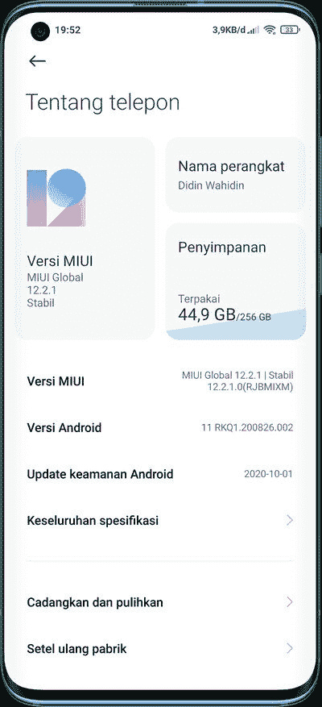

# 下载:小米为 Mi 10 和 Redmi K30 5G 推出了稳定的 Android 11 更新和 MIUI 12

> 原文：<https://www.xda-developers.com/xiaomi-mi-10-redmi-k30-5g-android-11-miui-12/>

看起来 Android 11 官方更新故事获得一些动力的时机已经成熟，至少从小米的角度来看。除了谷歌 Pixel 系列，设备制造商的官方 Android 11 更新很少，主要是与中国原始设备制造商打交道，如一加和 T2 的 OPPO T3。另一方面，自 9 月份以来，小米已经在[为少数 Mi/Redmi 智能手机运行有限的基于 Android 11 的 MIUI 12 试点计划](https://www.xda-developers.com/xiaomi-android-11-update-list-download-install/)。现在，对于 Mi 10 和 Redmi K30 5G 的用户来说，等待终于结束了，因为这两款设备终于收到了 MIUI 12 的官方 Android 11 更新。

**[小米米 10 XDA 论坛](https://forum.xda-developers.com/xiaomi-mi-10) || [红米 K30 5G XDA 论坛](https://forum.xda-developers.com/redmi-k30-5g)**

## 军情十处

虽然中国版本的米 10 对 Android 11 并不陌生，但全球模式却奇怪地缺乏支持。小米确实在 9 月份通过 MIUI 的稳定渠道为全球 Mi 10 提供了基于 Android 11 的版本( **V12.1.2.0.RJBMIXM** )，但 OTA 是针对早期用户的封闭群体。然而，目前的版本(内部版本号 **V12.2.1.0.RJBMIXM** )相对来说是一个大规模的推广。该更新的下载大小为 2.8GB，它携带了 2020 年 10 月的安全补丁。

 <picture></picture> 

Thanks to Twitter user [@didinwahidin_14](https://twitter.com/didinwahidin_14) for the screenshot!

**[为米 10 下载搭载 MIUI 12 的 Android 11(代号:umi) — V12.2.1.0.RJBMIXM](https://bigota.d.miui.com/V12.2.1.0.RJBMIXM/miui_UMIGlobal_V12.2.1.0.RJBMIXM_5dcaf5cf5a_11.0.zip)**

* * *

## 红米 K30 5G

除了 Mi 10，Redmi K30 5G 也正在接收其稳定的 Android 11 更新，以软件版本 **V12.1.1.0.RGICNXM** 的形式出现。与它的 4G 兄弟(全球称为 POCO X2)不同，5G 功能的 Redmi K30 迄今为止仍是中国独有的。

**[为红米 K30 5G(代号:毕加索)下载 Android 11 搭配 MIUI 12—v 12 . 1 . 1 . 0 . rgicnxm](https://bigota.d.miui.com/V12.1.1.0.RGICNXM/miui_PICASSO_V12.1.1.0.RGICNXM_45056581ec_11.0.zip)**

* * *

请记住，该公司仍然将这些更新视为“稳定测试版”。对于那些不熟悉小米更新政策的人来说，这意味着可能需要一个授权的 mi 帐户来下载 ZIP 文件。一旦小米将其标记为足够稳定，他们将翻转服务器端的开关，最终在闪烁之前消除这种授权的需要。或者，他们也可以发布带有额外错误修复的新版本。

* * *

*感谢 XDA 知名开发者 [yshalsager](https://forum.xda-developers.com/member.php?u=6084385) 提供下载链接！*