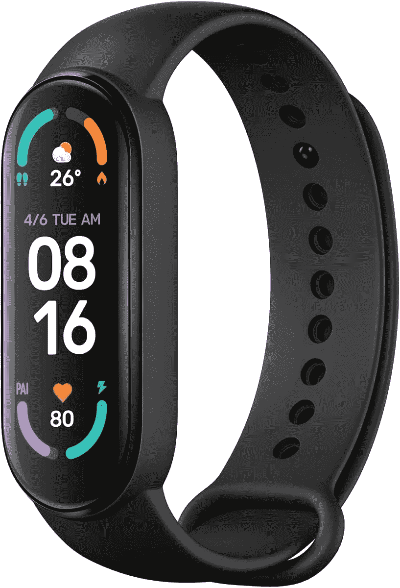

# 小米 Mi Band 6 仅在今天在英国处于有史以来的最低价格

> 原文：<https://www.xda-developers.com/xiaomi-mi-band-6-uk-sale-22/>

# 小米 Mi Band 6 仅在今天在英国处于有史以来的最低价格

小米 Mi Band 6 仅在今天在英国处于有史以来的最低价格，在亚马逊上仅售 22.99 英镑。

如果你想买一个智能健身追踪器，小米 Mi Band 6 是最好的选择。它提供了更多与 Mi Band 5 相同的功能，但有两项重大改进:屏幕尺寸从之前的 1.1 英寸增加到了 1.56 英寸，并且还有一个新的血氧(SpO2)传感器。现在你可以在英国从亚马逊买到它，价格是迄今为止最低的，仅为 22.99 英镑。不过你需要尽快行动，因为交易只限于今天。

**[阅读更多:小米手环 6 是小米](https://www.xda-developers.com/xiaomi-mi-band-6-review/)** 的又一款超值健身追踪器

 <picture></picture> 

Xiaomi Mi Band 6

##### 小米 Mi Band 6

Mi Band 6 是小米最负盛名的健身追踪器系列的最新款健身追踪器，具有更大的显示屏和血氧追踪功能。

自 2014 年推出第一款小米手环以来，小米的可穿戴设备，尤其是小米手环系列，长期以来一直非常畅销。当时，第一款 Mi 手环只有 3 个 LED 灯，没有心脏传感器。现在，我们在 Mi Band 6 中拥有一个成熟的、最高可达 450 尼特的边到边 AMOLED 显示屏、几个传感器和更多功能。虽然比第一个版本更贵，但结果是市场上最好的健身带之一。能够以 22.99 英镑的低价买到它，老实说，真是太便宜了。

请记住，如果你得到了小米 Mi Band 6，你还需要在智能手机上下载 Mi Fit 应用程序，以便你可以配置它并查看你的所有数据。如果你正在寻找一款新的智能追踪器，这个价格的 Mi Band 6 真的不会错。