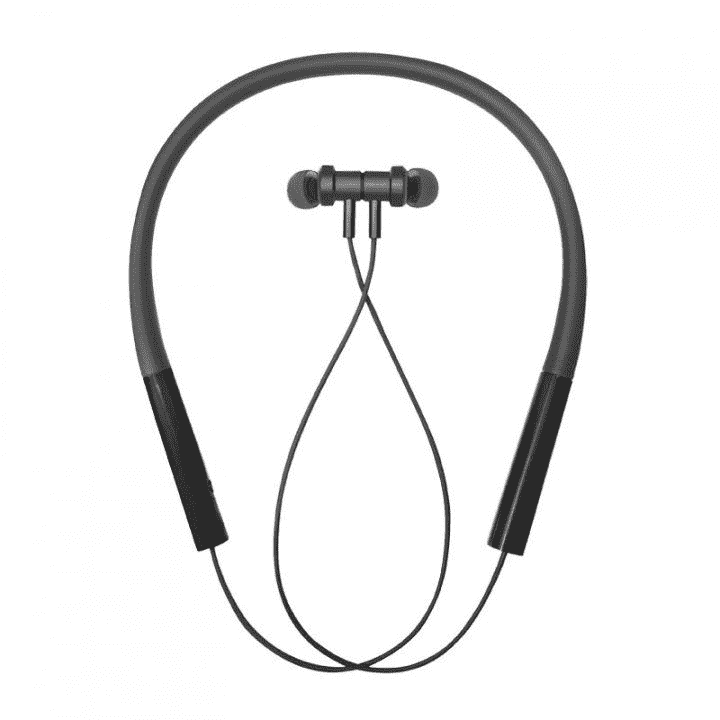

# 小米推出带 ANC 和 mi 便携音箱的 Mi Neckband Pro

> 原文：<https://www.xda-developers.com/xiaomi-mi-neckband-pro-anc-mi-portable-speaker-india-launch/>

小米周一扩大了其音频产品组合,增加了两款新品:mi Neckaband Pro 和 Mi 便携式蓝牙扬声器。Mi Neckband Pro 是 2019 年推出的 Mi Neckband 耳机的后续产品。虽然 Mi Neckband 旨在通过适度的功能提供经济实惠的无线音频体验，但小米将 Pro 变种定位为高端产品。为此，Mi Neckband Pro 确实为桌面带来了实质性的改进，从更长的电池寿命和更新的设计到主动噪音消除功能和改进的音频性能。

Mi Neckband Pro 耳机采用经典的橡胶项圈设计，电线穿过塑料模块并延伸至耳罩。所有控制装置都放在右侧，而左侧模块的外侧印有一个不显眼的 Mi 标志。小米表示，耳机具有防耳垢设计和防堵塞扬声器网，这两者都有助于防止耳垢和小灰尘颗粒堵塞扬声器。每个扬声器单元内部都装有一个 10 毫米的驱动器单元，据称可以提供低音驱动的音频。Mi Neckband Pro 采用蓝牙 5.0 协议，支持 AAC 和 SBC 编解码器。

 <picture></picture> 

Mi Neckband Pro

主动噪音消除(ANC)是 Mi Neckband Pro 的主要亮点，耳机声称可以将环境噪音降低高达 25db。环境噪音消除(ENC)也在飞机上，据说在接语音电话时可以降低 90%的环境噪音。电池续航时间在一次充电后可达 20 小时，并且您还可以获得 IPX5 等级的防汗和防溅保护。

Mi Neckband Pro 蓝牙耳机有黑色和蓝色两种款式，价格为₹1,799(～25 美元)，将于美国东部时间今天下午 1 点在 Mi.com 和亚马逊印度开始销售。

小米便携式蓝牙扬声器是小米无线扬声器系列的最新产品。它已经在一些市场有售，但是现在才进入印度市场。Mi 便携式蓝牙扬声器具有两个 8W 驱动器，可在旅途中提供强大的无线音频体验。它提供双均衡器模式，正常和低音，可以通过一个按钮切换。您也可以设置两个 Mi 扬声器来创造立体声。

内部有一个 2600 毫安时的电池，可以通过 USB Type-C 端口充电。一次充电，Mi 便携式蓝牙音箱可持续使用长达 13 小时。它还内置了一个麦克风，用于接听语音电话和召唤您的语音助手。扬声器工作在蓝牙 5.0 上，具有 IPX7 防水功能。

Mi 便携式蓝牙扬声器有蓝色和黑色两种颜色，将从今天开始在₹2,499[Mi.com](https://store.mi.com/in/item/3210700007)发售(约 35 美元)。