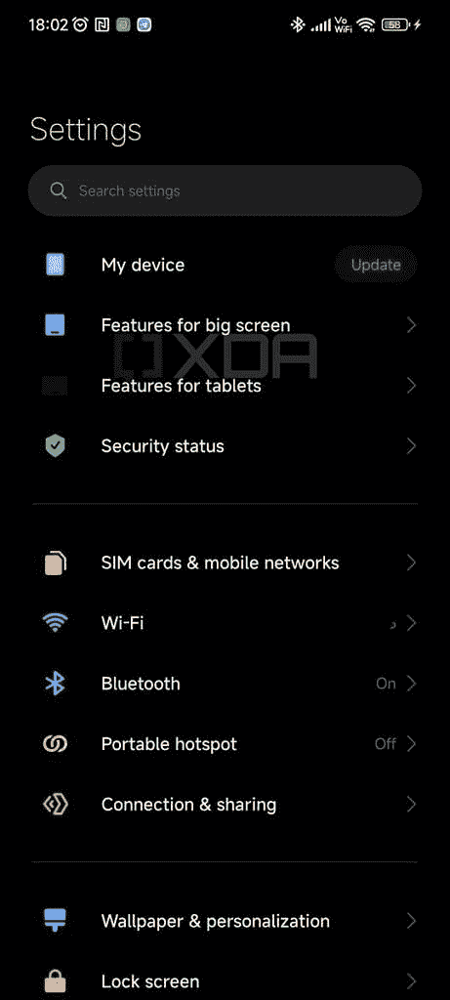

# 小米继续在 MIUI 中开发新的平板电脑和可折叠功能

> 原文：<https://www.xda-developers.com/xiaomi-miui-tablet-foldable-features/>

小米定制的 Android 皮肤 MIUI 已经为大屏幕设备提供了几个有用的功能。正如 Ben 在他对小米 Pad 5 的[评论中指出的，平板电脑上的 MIUI 提供了许多方便的功能，如在浮动窗口中打开多个应用程序的能力，分屏视图支持，主屏幕 dock 等等。然而，它远非完美。](https://www.xda-developers.com/xiaomi-pad-5-review/)

值得庆幸的是，小米意识到了这些缺点，并正在努力在 MIUI 中添加大量新功能，为用户提供更好的平板电脑和可折叠设备体验。XDA 资深会员和值得信赖的小米情报人员 [*kacskrz*](https://forum.xda-developers.com/m/kacskrz.8240900/about) 已经在最新的 MIUI 13 测试版中发现了一些即将到来的变化，让我们清楚地知道了即将到来的平板电脑和可折叠手机 MIUI 版本的预期。

## 平板电脑和可折叠设备的 MIUI 13 有什么新功能？

最新的中国版 MIUI 13 测试版在设备设置中添加了两个新菜单项，分别名为“大屏幕功能”和“平板电脑功能”。只有当目标设备是“子站”([小米即将推出的可折叠](https://www.xda-developers.com/xiaomi-zizhan-next-foldable/))或“大谷”(即将推出的基于骁龙 865/870 的仅支持 Wi-Fi 的小米平板电脑)时，这些新菜单项才会出现。

 <picture></picture> 

Credit: kacskrz

正如你在所附的截图中看到的那样，新的“大屏幕功能”页面包括可折叠设备的新壁纸选项，“应用显示模式”设置，游戏的定制，新的键盘选项，浮动窗口设置，以及设备折叠或展开时的显示行为设置。

*信用:kacskrz*

另一方面，“平板电脑功能”页面包括“应用程序显示模式”定制，MIUI+ Beta 选项，平板电脑键盘定制和浮动窗口设置。这些新菜单选项中列出的大多数功能在当前的测试版中都没有。然而， *kacskrz* 已经设法抓取了一些展示平板电脑和可折叠设备新键盘选项的图形。

以下图片展示了可折叠设备的新键盘布局，用户可以将键盘从中间分开，从而在大屏幕上更容易使用。这种分离键盘布局将为用户提供进一步的定制选项。其中包括复制中央按钮的能力，以获得更灵活的输入体验，以及一次点击即可切换键盘的左半部分和右半部分的选项。

*信用:kacskrz*

虽然我们无法访问其他新选项的类似图像，但我们确实有一些关于它们的信息，这要感谢几个新的代码字符串。字符串显示，“折叠后保持屏幕打开”设置将为用户提供选项，以防止设备在折叠时锁定屏幕，在通话或使用相机时折叠后保持外屏幕打开，以及在折叠后保持覆盖屏幕打开以继续执行当前任务。

此外，在“大屏幕功能”页面上关于新“游戏”选项的字符串表明，它将为用户提供一些游戏显示选项，让他们将游戏窗口限制在显示器的某个部分或以全屏模式播放。该选项可能会让用户移动游戏窗口，并将其与显示器的顶部、底部或侧边对齐。

如前所述，这些新功能在最新的 MIUI 13 测试版中并未上线。目前，我们也没有来自小米的任何官方信息。但是一旦我们有更多的细节，我们一定会让你知道。

*你如何看待这些平板电脑和可折叠设备的 MIUI 新功能？请在下面的评论区告诉我们。*