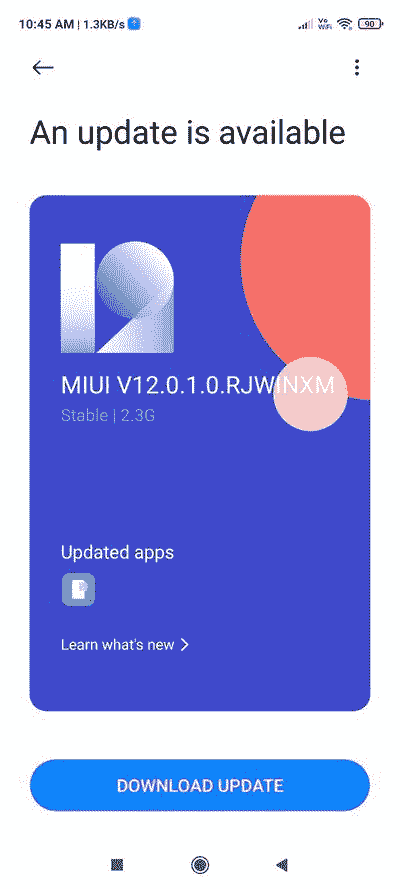

# 红米 Note 9 Pro 和红米 Note 9S 随 Android 11 获得 MIUI 12 更新

> 原文：<https://www.xda-developers.com/xiaomi-redmi-note-9-pro-android-11-miui-12/>

**更新 1 (02/01/2021 @美国东部时间下午 12:23):**Android 11 更新 MIUI 12 现已通过稳定渠道向红米 Note 9S 用户推出。[点击此处获取信息。](#update1)发表于 2020 年 11 月 18 日的文章，保存如下。

小米的 Redmi Note 9 Pro 是印度早期中端市场上最值得购买的产品之一，它以极具竞争力的价格点提供了一个[伟大的硬件包。这款手机配有高通骁龙 720G 芯片，令人印象深刻的四摄像头阵列，5020 毫安时大电池，支持高达 18W 的快速充电。智能手机](https://www.xda-developers.com/xiaomi-redmi-note-9-pro-review-snapdragon-720g-48mp/)[在几个月前获得了稳定的 MIUI 12 更新](https://www.xda-developers.com/download-miui-12-stable-update-rolling-out-several-xiaomi-redmi-mi-poco-devices/)，现在正在印度获得其 Android 11 更新。

**[红米 Note 9 Pro XDA 论坛](https://forum.xda-developers.com/redmi-note-9-pro)**

承载版本号 **V12.0.1.0.RJWINXM** ，更新大小为 2.3GB，为其恢复可闪存 ZIP。如前所述，这个版本是为了红米 Note 9 Pro 的印度版本(代号:中的“curtana_ *”)，这意味着它不能安装在全球红米 Note 9 Pro(代号:“joyeuse_ *xx* ”)上。然而，红米 Note 9S(代号:“curtana_ *xx* ”)的用户可以使用 TWRP 等定制恢复解决方案手动刷新更新包。*

 <picture></picture> 

Thanks to Twitter user [@Brindhaukender](https://twitter.com/Brindhaukender) for the screenshot!

由于这是这款手机首次公开构建 Android 11，我们预计会有大量的 bug，也许还有一些稳定性问题。因此，只建议精通 flash 更新的有经验的用户下载这个版本。请在更新之前做好足够的数据备份。

**[下载红米 Note 9 Pro(代号:curtana)搭载 MIUI 12 的 Android 11—v 12 . 0 . 1 . 0 . rjwinxm](https://bigota.d.miui.com/V12.0.1.0.RJWINXM/miui_CURTANAINGlobal_V12.0.1.0.RJWINXM_3ad7d510e0_11.0.zip)**

请注意，该公司将当前更新视为“稳定测试版”，这与常规的稳定版本有点不同。可能需要一个授权的 Mi 帐户来加载上述 ZIP 文件。一旦小米将其标记为足够稳定，他们将翻转服务器端的开关，最终在闪烁之前消除这种授权的需要。

* * *

## 更新:红米 Note 9S 也是

在去年 11 月开始在印度红米 Note 9 Pro 设备上推出后，Android 11 现在开始在全球范围内推出红米 Note 9S T1，并于 2021 年 1 月在 T2 发布 T3 安全补丁。侧面加载友好的更新 ZIP 可使用以下链接下载:

**[下载红米 Note 9S(代号:curtana)搭载 MIUI 12 的 Android 11—v 12 . 0 . 1 . 0 . rjwmixm](https://bigota.d.miui.com/V12.0.1.0.RJWMIXM/miui_CURTANAGlobal_V12.0.1.0.RJWMIXM_e29d7b7c84_11.0.zip)**

* * *

*感谢 XDA 知名开发者 [yshalsager](https://forum.xda-developers.com/member.php?u=6084385) 提供下载链接！*