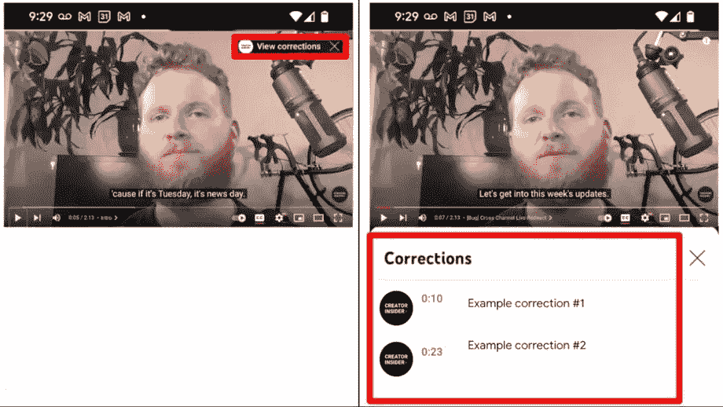

# YouTube 的新修正功能可以帮助创作者突出他们视频中的错误

> 原文：<https://www.xda-developers.com/youtube-corrections-feature-helps-creators-highlight-errors/>

# YouTube 的更正功能为创作者提供了一种新的方式来突出他们视频中的错误

YouTube 今天宣布了一项新的更正功能，让创作者可以轻松地突出他们视频中的任何错误。请继续阅读，了解更多信息。

YouTube 今天推出了一个名为“更正”的新功能，以帮助创作者轻松地突出他们视频中的错误。该功能允许创作者在视频的右上角添加带有相关时间戳的信息卡，以列出视频上线后对视频所做的所有修改。

YouTube 的创作者目前必须编辑并重新上传视频，如果他们想做任何更正的话。或者，他们可以突出显示视频描述中的更正或作为固定评论。所有这些选择都不太理想，并且有明显的缺点。YouTube 的新更正功能提供了一个标准的解决方案，让创作者的生活变得轻松，也帮助观众在一个方便的位置找到所有更新。

 <picture></picture> 

Left: View corrections info card; Right: Corrections examples

如前所述，该功能在视频的右上角显示为*视图校正*信息卡。它只显示视频中的第一次更正，观众可以点击它来查看更多细节和任何后续更正。所有的更正都将有一个时间戳，以帮助观众快速跳转到视频的更新部分，以及一些澄清文本。

纠正功能将于本月底向所有 YouTube 创建者推出。但如果一个频道有任何活跃的罢工或内容不适合某些观众，该功能将不可用。如果你是 YouTube 的创建者，想要对你的视频进行修改，你可以访问 YouTube 的支持页面，按照说明开始。您也可以查看上面嵌入的视频，以了解有关该功能的更多信息。

你对 YouTube 的新纠错功能有什么看法？您希望信息卡显示所有更正吗？请在下面的评论区告诉我们。

* * *

**Via:** [濒临绝境](https://www.theverge.com/2022/6/15/23168884/youtube-add-corrections-feature-annotations-creators)

**来源:** [创作者内幕](https://www.youtube.com/watch?v=e5kl7hxtgHo)