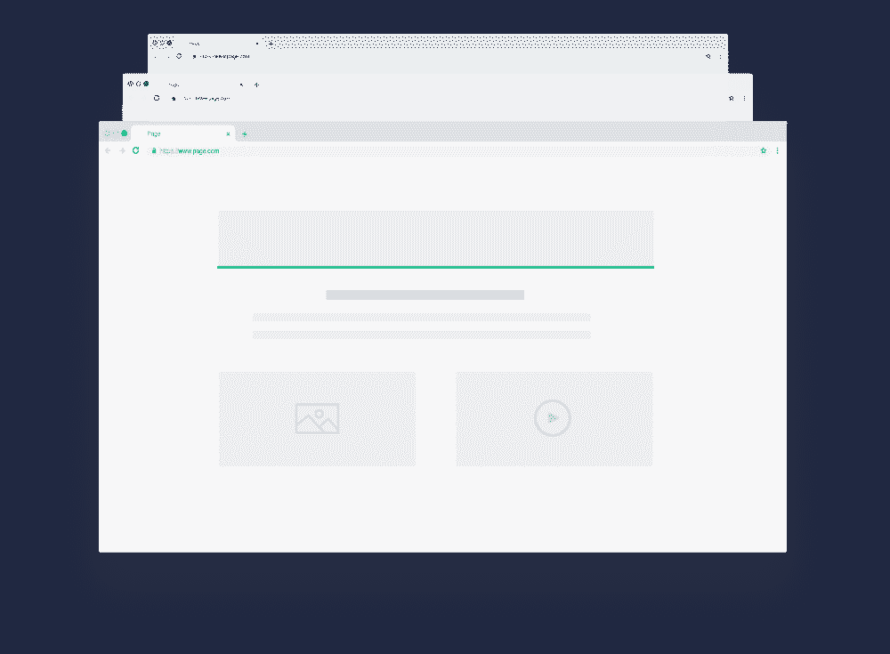
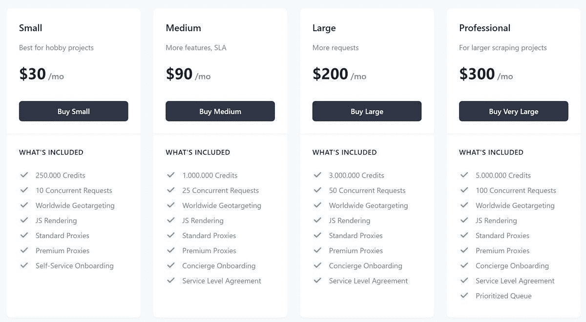

# Zenscrape 大规模 Web 抓取和提取 API

> 原文：<https://www.xda-developers.com/zenscrape/>

大规模的网络抓取并不一定是一项复杂和令人沮丧的任务。人们在搜集数据时必须跨越的一些更常见的障碍是 IP 禁令和可伸缩性。这些障碍可以通过 Zenscrape Web Scraping API 来避免。

我们的网页抓取 API 处理所有与网页抓取相关的问题。网站 HTML 提取从来没有这么容易过！

当你使用 Zensrape 作为你的网络抓取解决方案时，你将能够运行可伸缩的操作，从小型的一次性使用到大型的正在进行的项目。使用一个巨大的 IP 池，Zenscrape 可以避免阻止你抓取的 IP 禁令。您甚至可以选择代理位置来显示地理定位内容。自动代理轮换是一个包含的功能，允许您通过隐藏您的抓取机器人来避免遇到网站的速率限制。

为了确保你能够抓取用户在网站上看到的每一部分，Zenscrape 呈现了 Javascript。这将有助于从其他刮刀通常无法呈现的区域获取更多数据。您还可以根据需要呈现特定的元素。

 <picture></picture> 

Zenscrape Javascript Rendering

支持所有前端框架。这意味着使用 Vue、React 或其他前端框架的网站和单页应用不再是问题。

## 免费试用 Zenscrape

在你决定购买一个计划之前，使用在这里找到的演示免费试用 Zenscrape。免费订阅每月将为您提供多达 1，000 个 API 请求。免费计划也有资格获得 1，000 个免费积分来使用 API。

为了给你提供最好的开发体验，Zenscrape 还创建了一个包含所有端点的 Postman 集合，包括大量的例子。看邮递员例子[这里](https://app.getpostman.com/run-collection/85f8b936e3e1870c3fa9)。Zenscrape 可以用于任何编程语言，因为任何 HTTP 客户端都可以简单地检索数据。

当您准备好从 Webscrape 获取计划时，您可以从以下定价选项中进行选择:

 <picture></picture> 

Zenscrape Pricing

如果你想找到更多关于这个 API 的信息，你可以和 Zenscrape 的代表聊天，他会免费回答你的问题。要开始使用，请访问 Zenscrape 官方网站[这里](https://zenscrape.com/)。

[**得到禅刮**](https://zenscrape.com/)

###### 我们感谢 Zenscrape 赞助了这篇文章。我们的赞助商帮助我们支付与运行 XDA 相关的许多费用，包括服务器成本、全职开发人员、新闻撰稿人等等。虽然您可能会在门户内容旁边看到赞助内容(这些内容将始终被标记为赞助内容),但门户团队对这些帖子不承担任何责任。赞助内容、广告和 XDA 仓库完全由一个独立的团队管理。XDA 绝不会通过接受金钱来赞扬一家公司，或以任何方式改变我们的观点或看法，从而损害其新闻诚信。我们的意见不能被收买。