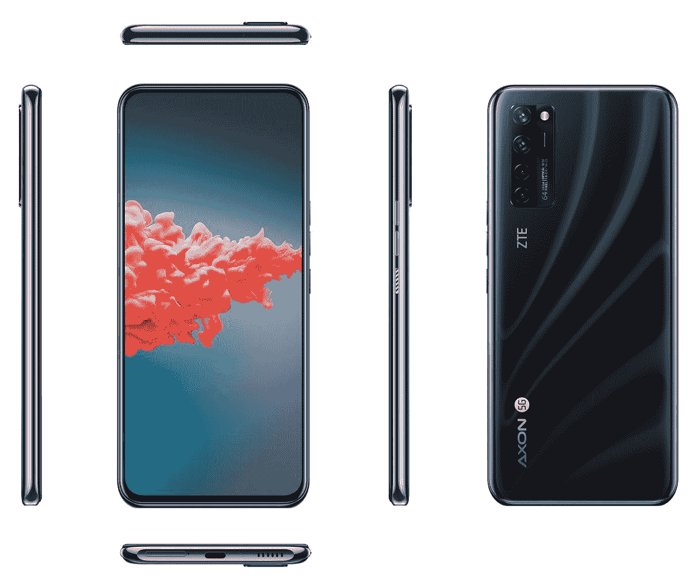
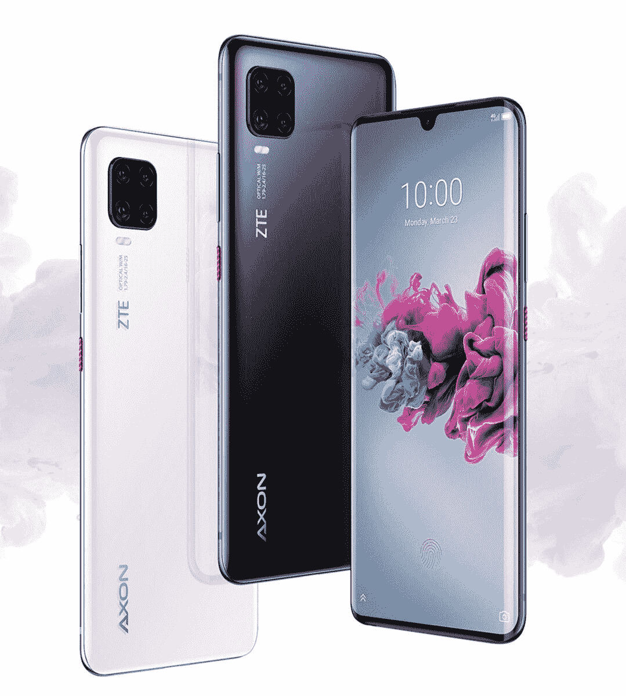
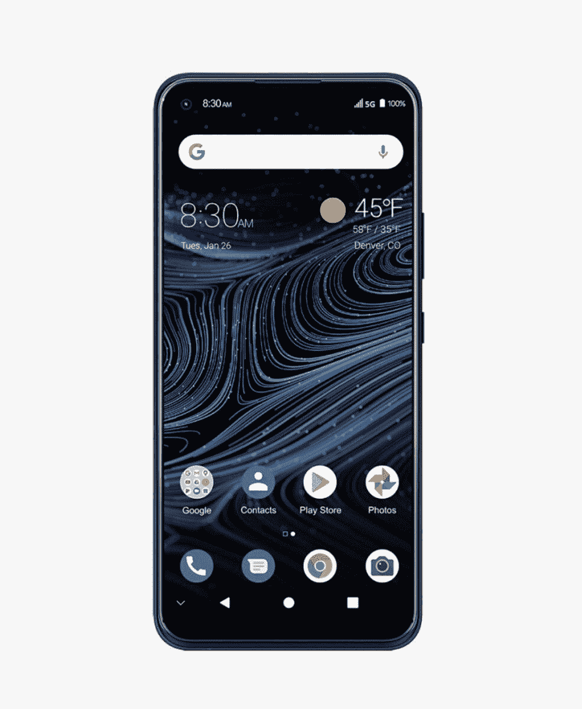
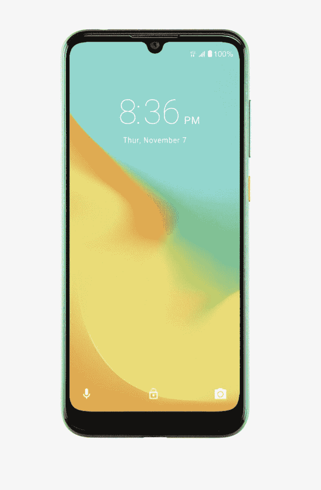
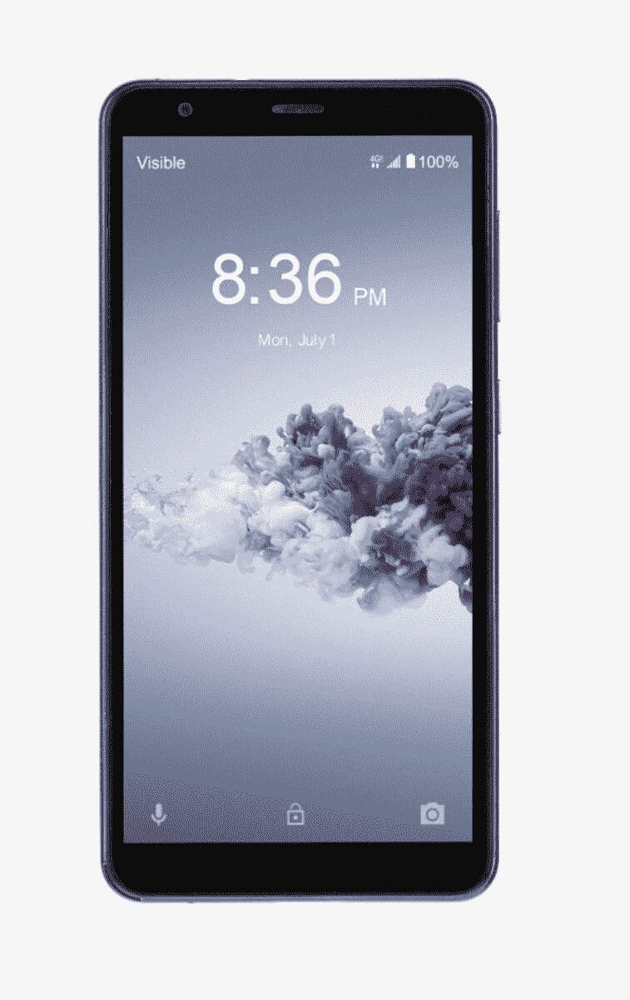
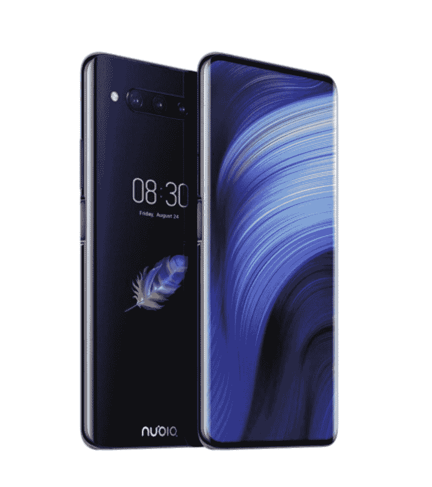
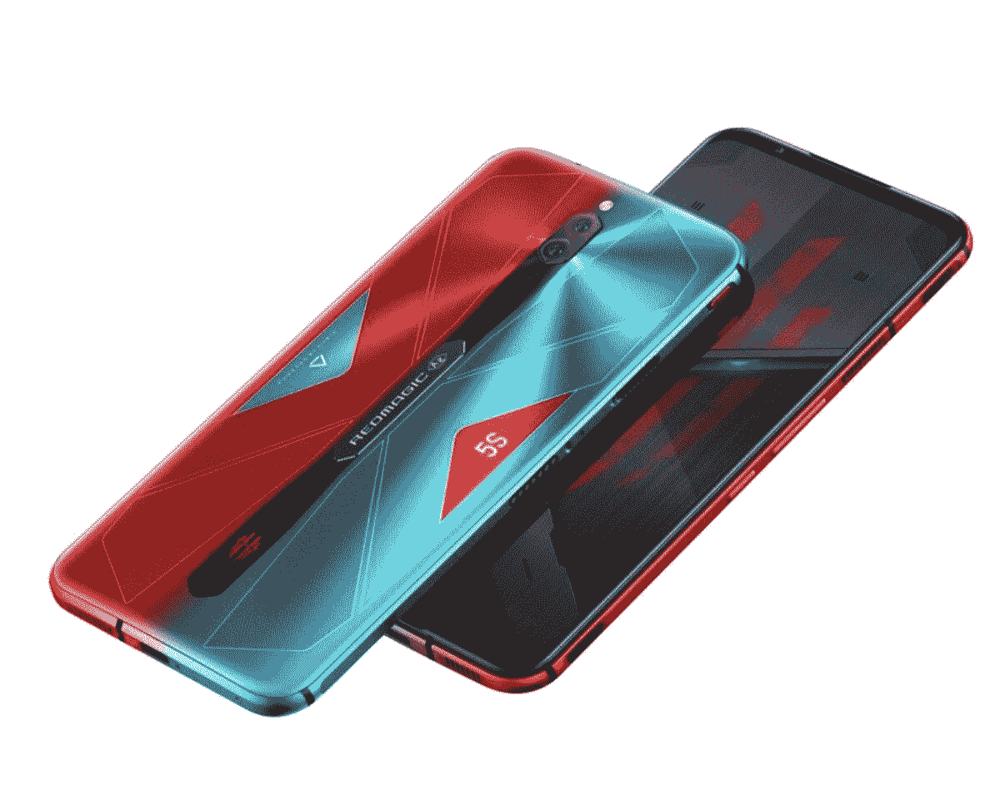
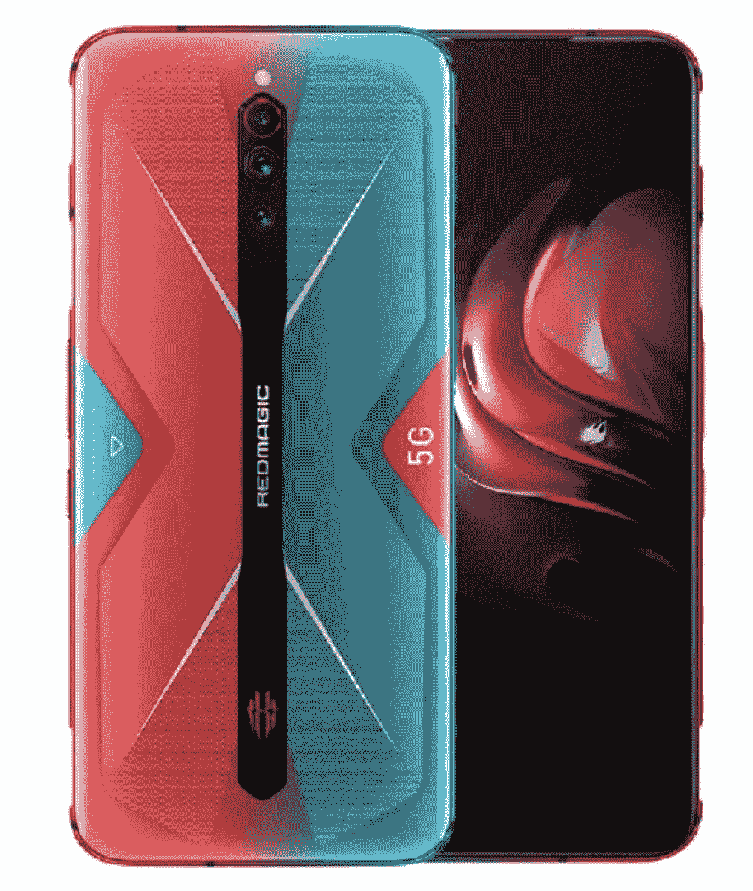

# 2023 年最佳中兴手机

> 原文：<https://www.xda-developers.com/ztes-spro-plus-is-an-android-projector-that-doubles-as-a-tablet-and-hotspot/>

曾几何时，中兴是全球五大智能手机制造商之一。但面对来自苹果、三星、华为和谷歌等主要品牌的日益激烈的竞争，这家中国科技公司在全球智能手机排名中迅速下滑。

除了试图进入高度拥挤和竞争激烈的智能手机市场，中兴还被视为对美国国家安全的威胁，因为它涉嫌与中国政府有关联，而且还在美国接受了贿赂调查。但尽管面临这些挑战，中兴通讯继续发布规格体面、价格实惠的 Android 智能手机。

2012 年，中兴还成立了新的手机子公司，名为努比亚。三年后，它最终成为了一项独立的业务。今天，努比亚是一家受欢迎的中国智能手机制造商，提供各种创新和预算友好的 Android 设备。

如果你正在寻找一款物超所值的 Android 智能手机，那么值得考虑中兴或努比亚的手机。但鉴于两家公司都提供大量不同的智能手机，你可能会想知道选择哪种型号。为了帮助你选择一款，我们收集了 2022 年最好的中兴和努比亚智能手机。

## 中兴 Axon 20 5G

中兴通讯在 2020 年占据了头条新闻，当时它宣布了世界上第一款带有下显示摄像头的智能手机:[Axon 20 5G](https://www.xda-developers.com/zte-axon-20-5g-under-display-camera-hands-on/)。这是一款中端 Android 智能手机，提供 6.92 英寸 FHD+显示屏，5G 连接，6400 万像素的人工智能四摄像头，位于屏幕下方的 3200 万像素前置摄像头，骁龙 765G 处理器，4,220mAh 电池，8GB 内存，128GB 板载内存，Android 10 等。

 <picture></picture> 

ZTE Axon 20 5G

##### 中兴 Axon 20 5G

中兴 Axon 20 5G 是有史以来第一款配备下显示摄像头的智能手机，而且令人惊讶的是，它非常便宜。

## 中兴 Axon 11

Axon 11 是中兴通讯目前提供的最好的 Android 智能手机之一。它配备了 6.47 英寸 2340 x 1080 显示屏，4000 毫安时电池，无线充电，四摄像头，2000 万像素自拍摄像头，高达 8GB 的内存，高达 256GB 的内部内存，内置指纹传感器，八核处理器，Android Q 和许多其他伟大的功能。

 <picture></picture> 

ZTE Axon 11

##### 中兴 Axon 11

Axon 11 是中兴通讯最好的安卓手机之一，提供大显示屏、大电池、四摄像头等等。

## 中兴 Blade X1 5G

如果你想要一部不会破产的 5G 智能手机，你应该看看中兴 Blade X1 5G。它的价格仅为 384 美元，具有 5G 连接能力，6.5 英寸 2340 x 1080 显示屏，60Hz 刷新率，4,000mAh 电池，DTS:X Ultra audio，人工智能驱动的四摄像头，1600 万像素前置摄像头，6GB 内存，128GB 板载存储，高达 2TB 的可扩展存储，骁龙 765G 处理器，Android 10 等等。

 <picture></picture> 

ZTE Blade X1 5G

##### 中兴 Blade X1 5G

中兴 Blade X1 5G 的价格不到 400 美元，是提供 5G 连接的最便宜的智能手机之一。此外，它还提供了大显示屏、大电池、Android 10 等。

## 中兴 Blade A7 Prime

Blade A7 Prime 是中兴的一款廉价安卓智能手机。其顶级功能包括分辨率为 720 x 1560 像素的 6.09 英寸显示屏，四核联发科 MT6761 处理器，3GB 内存，32GB 内存，最高 2TB 的可扩展内存，3,200mAh 电池，1600 万像素后置摄像头，500 万像素前置摄像头，Android 9.0 (Pie)等。

 <picture></picture> 

ZTE Blade A7 Prime

##### 中兴 Blade A7 Prime

中兴 Blade A7 Prime 是一款功能丰富的 Android 智能手机，不会破产。它提供了一个大显示屏，一个像样的摄像头，一个大电池，等等。

## 中兴 Blade A3 Prime

Blade A3 Prime 是另一款超级实惠的中兴智能手机，提供 5.45 英寸 720p 高清显示屏，800 万像素双闪光灯后置摄像头，500 万像素前置摄像头，2,660mAh 可拆卸电池，2GB 内存，32GB 内部存储，可扩展存储高达 2TB，四核联发科 MTK6761 处理器，后置指纹扫描仪，面部解锁和 Android 10。考虑到这是一个 49 美元的设备，你得到了很多功能。

 <picture></picture> 

ZTE Blade A3 Prime

##### 中兴 Blade A3 Prime

中兴 Blade A3 Prime 非常适合任何想要一款小巧实惠、规格体面的 Android 智能手机的人。

## 努比亚 Z20

努比亚目前的旗舰智能手机是 Z20，它确实是一款非凡的设备。Nubia Z20 与其他 Android 智能手机的区别在于它的双显示屏。在设备的正面，你会发现一个 6.42 英寸的显示屏。与此同时，手机背面有一个额外的 5.1 英寸显示屏。

在其他功能方面，Nubia Z20 拥有三摄像头系统，配有 4800 万像素主镜头，3 倍光学变焦，4000 毫安时电池，骁龙 855 Plus 处理器，8GB 内存，128GB 内部存储，Android 9 等。对于任何想要独特东西的人来说，这绝对是一款完美的手机。

 <picture></picture> 

Nubia Z20

##### 努比亚 Z20

Nubia Z20 是当今市场上最独特的智能手机之一，提供两个高分辨率显示屏和许多其他优秀的功能。

## 努比亚 RedMagic 5S

如果你是一个铁杆游戏玩家，你会喜欢 Nubia RedMagic 5S。这是一款游戏智能手机，配备 6.65 英寸 eSport AMOLED 显示屏，144Hz 刷新率，骁龙 865 处理器，双模 5G，12GB 内存，256GB 板载内存，内置 320Hz 肩部触发器，4,500mAh 电池，带涡轮风扇的 ICE 4.0 主动液体冷却技术，带 6400 万像素主传感器的三摄像头，高级金属和玻璃设计等等。

 <picture></picture> 

Nubia RedMagic 5S

##### 努比亚 RedMagic 5S

寻找最好的游戏手机之一？那就看看努比亚的 RedMagic 5S 吧。它拥有一个大显示屏，144 赫兹的刷新率，一个快速的处理器，等等。

## 努比亚 RedMagic 5G

RedMagic 5G 是努比亚的另一款最新游戏智能手机，其规格与 RedMagic 5S 相似。你可以获得 6.65 英寸 AMOLED 显示屏，刷新率为 144Hz，双模 5G 连接，骁龙 865 处理器，带涡轮风扇 3.0 的主动液体冷却技术，12GB 内存，256GB 内部存储，集成肩部触发按钮，三摄像头，4,500mAh 电池，Android 10 等等。

 <picture></picture> 

Nubia RedMagic 5G

##### 努比亚 RedMagic 5G

RedMagic 5G 是一款出色的游戏智能手机，拥有大显示屏、144Hz 刷新率、双模 5G、骁龙 865 处理器等等。

* * *

正如你所看到的，中兴和努比亚都为所有用户和预算提供了出色的 Android 智能手机。但是，您应该购买哪种型号呢？对于任何想要负担得起的 5G 就绪 Android 智能手机的人，我们推荐中兴 Blade X1 5G。除了提供 5G 连接，它还拥有一个大显示屏，一个四摄像头和许多其他功能，价格不到 400 美元。

但也有更便宜的中兴手机，中兴 Blade A7 Prime 和中兴 Blade A3 Prime 就是很好的例子。同时，如果你想要一些不同的东西，NUBIA Z20 是一个完美的选择，游戏玩家会喜欢 Nubia RedMagic 5G。

如果你不是特别想买中兴通讯的设备，你可以看看我们的最佳安卓智能手机列表，看看我们在各个制造商中挑选的一些顶级产品。

你有中兴或努比亚的智能手机吗？如果有，你喜欢它的什么？我们很乐意在下面的评论区听到你的想法。